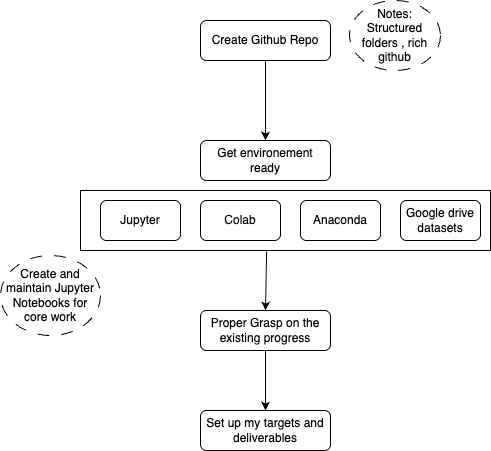
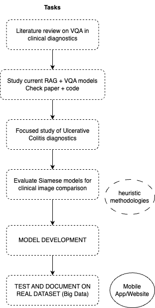

# VQA-RAG for Clinical Diagnostics Thesis

**Author:** Sarthak Kaushik  
**Supervisor:** Dr. Sabah Mohammad, Dr. Jinan Fiadhi 
**Affiliation:** Lakehead University

## Project Overview
This thesis explores Visual Question Answering (VQA) combined with Retrieval-Augmented Generation (RAG) for assisting diagnosis in gastrointestinal imaging, focusing on ulcerative colitis.

## Initial Getting Started Task 

## Tasks 

## Design tools 

Research Diagrams 

* draw.io 
* lucidchart

Model Architecture Design 

* miro 
* whimsical 
* plantUML

UI/UX Design for Final Product

* Figma 
* Adobe XD 

Presentations & Docs 

* Canva 
* Google Slides

Planning Timeline 

* Clickup 
* Notion 
* Trello 

