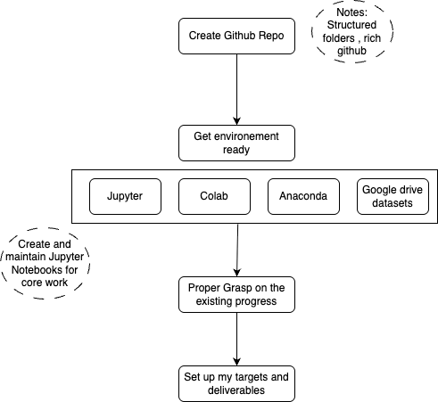
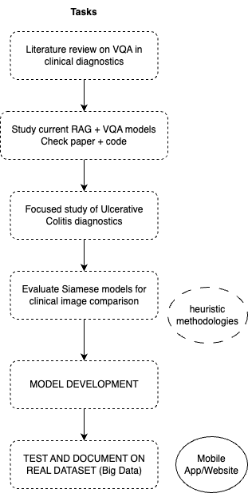
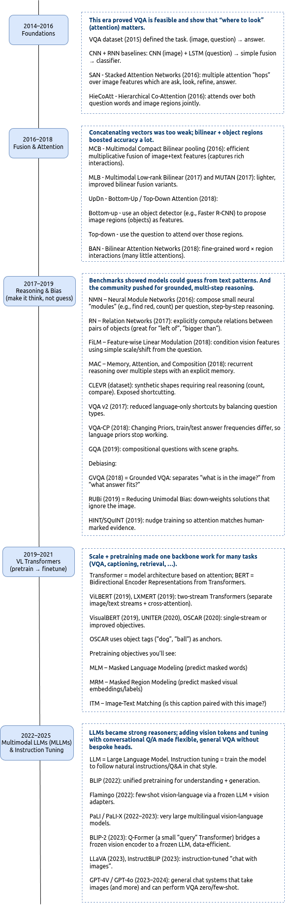

# 📑 VQA-RAG for Clinical Diagnostics Thesis  

**Author:** Sarthak Kaushik  
**Supervisors:** Dr. Sabah Mohammad, Dr. Jinan Fiadhi  
**Affiliation:** Lakehead University  

---

## 🎯 Project Overview  

This thesis investigates the integration of **Visual Question Answering (VQA)** with **Retrieval-Augmented Generation (RAG)** to enhance diagnostic assistance in **gastrointestinal imaging**, with a particular focus on **ulcerative colitis**.  

The aim is to develop a system that:  
- Interprets medical images (endoscopy/colonoscopy).  
- Answers clinically relevant questions with **context-aware reasoning**.  
- Retrieves supporting evidence from **medical knowledge sources**.  
- Provides **explainable insights** to support clinicians in decision-making.  

Ultimately, the project contributes to **AI-assisted diagnostics**, bridging the gap between visual understanding, natural language reasoning, and evidence retrieval.  

---

## 🏗️ Project Structure  

The project is divided into **phases** to ensure systematic research, design, and implementation.  

### 1. **Initial Task**  
Understanding core VQA challenges in the medical domain and establishing baselines.  

  

---

### 2. **Milestones & Deliverables**  
A series of milestones structure the thesis, covering **data exploration, model development, evaluation, and final prototype**.  

  

---

### 3. **VQA Research Timeline**  
The timeline of VQA research.  

  

---

## 🛠️ Tools & Design Workflow  

To achieve both **technical rigor** and **clear communication of research**, multiple tools are used across design, modeling, and presentation.  

### 🔹 Research Diagrams  
- **draw.io** – System workflows & UML diagrams  
- **Lucidchart** – High-level concept mapping  

### 🔹 Model Architecture Design  
- **Miro** – Brainstorming & idea structuring  
- **Whimsical** – Experiment flow design  
- **PlantUML** – Technical architecture diagrams  

### 🔹 UI/UX for Final Prototype  
- **Figma** – Wireframes & interactive prototypes  
- **Adobe XD** – High-fidelity UI mockups  

### 🔹 Presentations & Documentation  
- **Canva** – Visual slides & posters  
- **Google Slides** – Research presentations  

### 🔹 Planning & Timeline Tracking  
- **ClickUp** – Task management  
- **Notion** – Knowledge organization  
- **Trello** – Milestone tracking  

---

## 🌟 Key Outcomes  

By the end of this thesis, the project will deliver:  
1. A **working VQA-RAG prototype** for gastrointestinal image-based diagnostics.  
2. A **comparative evaluation** of baseline VQA models vs. VQA-RAG.  
3. Research contributions in:  
   - Domain-specific VQA datasets (colonoscopy/ulcerative colitis).  
   - Efficient retrieval mechanisms for medical QA.  
   - Explainability in AI-driven clinical support.  

---

## 📌 How to Use This Repository  

This repository serves as the **central hub** for:  
- Research documentation (papers, notes, references).  
- Experiment code (data exploration, model training, evaluation).  
- Diagrams and architecture designs.  
- Timeline and milestone tracking.  

---

✨ This README is designed to give **professors, collaborators, and future researchers** a clear understanding of the project scope, methods, and progress at a glance.  
