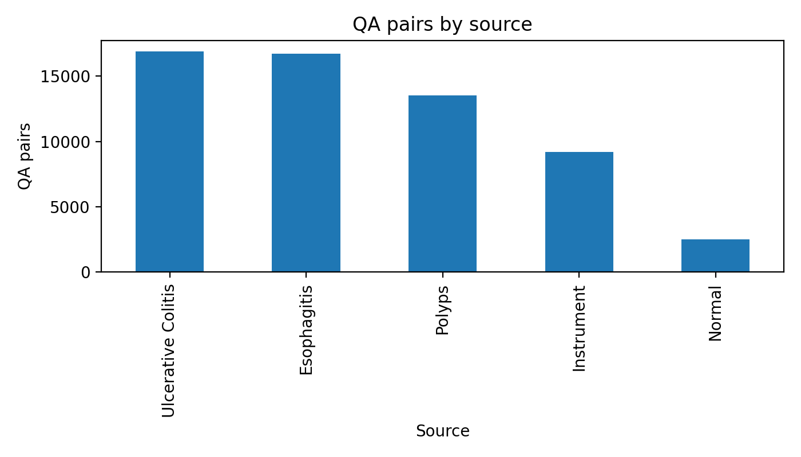
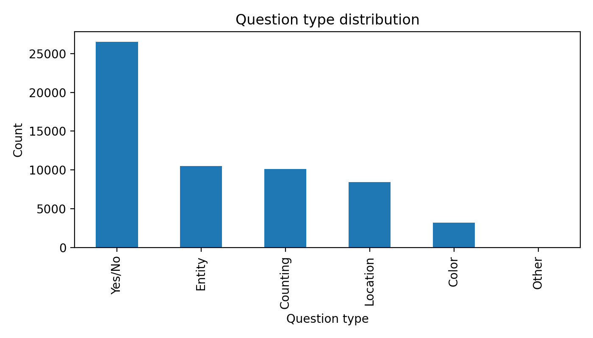
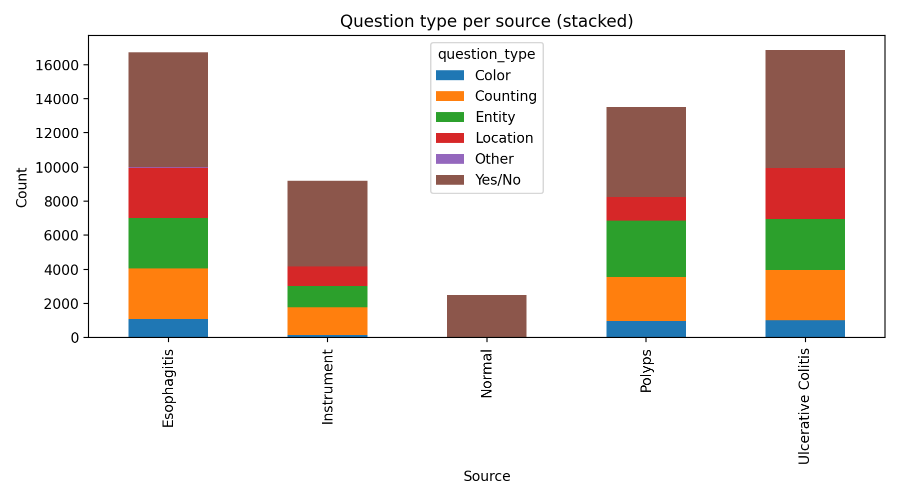
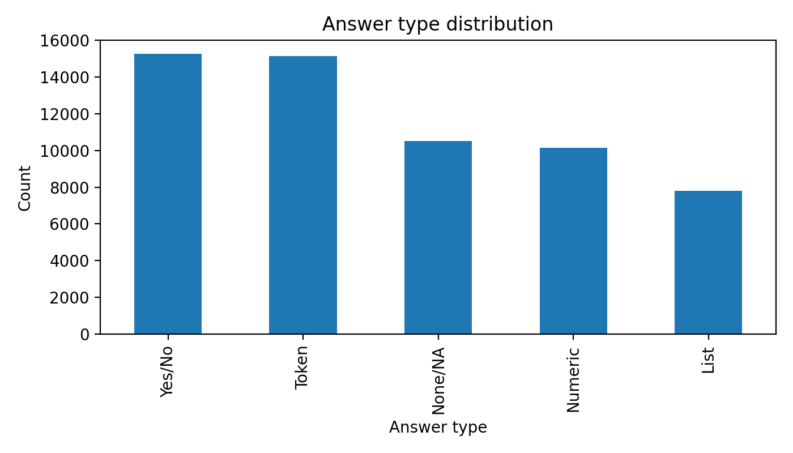

# Chapter 3: Investigating Existing VQA Techniques Across GI-Endoscopy Datasets

## 3.1 Chapter Overview and Evaluation Goal

Chapter 2 provided the conceptual and literature foundation for GI-endoscopy VQA. Chapter 3 is the empirical turning point of the dissertation: it moves from review to direct evidence by auditing persisted experimental artifacts and quantifying how current model families behave under realistic dataset constraints.

The core question is not only "which model gets higher scores," but "which model behavior is reliable enough for clinically relevant use-cases." To answer that question, this chapter evaluates reliability across heterogeneous task regimes, including closed-label prediction, open-ended generation, and ordinal severity assessment. The chapter is intentionally reproducibility-first: all analyses are compiled from saved artifacts, with explicit source paths and no undocumented reruns.

Concretely, the chapter objective is to determine, with traceable local evidence, how existing model families perform across:

1. closed-set and binary clinical question answering,
2. open-ended generative answering,
3. severity-oriented ordinal assessment,
4. class-imbalance stress conditions,
5. and scenario-level stress-test protocol definitions for clinically relevant failure probing.

Unlike Chapter 2 (literature synthesis), this chapter is artifact-driven. All claims are derived from saved outputs in this repository, not from newly run training in this chapter.

This chapter serves three thesis-level functions:

1. Establish a reproducible baseline of current GI MedVQA behavior before introducing new methods.
2. Identify practical reliability bottlenecks (imbalance sensitivity, answer-format instability, OOV projection fragility, and clinical threshold failures).
3. Provide a defensible empirical bridge to Chapter 4, where evidence-grounded generative approaches are developed to address these bottlenecks.

Structurally, Section 3.1 defines evidence boundaries and research questions, Section 3.2 formalizes datasets and experimental regimes, Section 3.3 justifies the evaluation protocol, Section 3.4 presents dataset-wise results, and Section 3.5 synthesizes cross-dataset findings into thesis-level conclusions.

### 3.1.1 Evidence Boundary and Reproducibility Scope

**Table 3.1. Primary Evidence Sources Used in Chapter 3**

| Dataset / analysis block | Primary report file | Persisted artifact roots | Primary task style |
|---|---|---|---|
| HyperKvasir | `Prototyping_reformat/DatasetAnalysis/HyperKvasir/HyperKvasir.md` | `Prototyping_reformat/DatasetAnalysis/HyperKvasir/**/out` | 23-class visual classification |
| ImageCLEF MEDVQA-GI 2023 | `Prototyping_reformat/DatasetAnalysis/ImageCLEF_MEDVQA_GI_2023/ImageCLEF_MEDVQA_GI_2023.md` | `Prototyping_reformat/DatasetAnalysis/ImageCLEF_MEDVQA_GI_2023/**/results` | closed-label GI VQA |
| Kvasir-VQA | `Prototyping_reformat/DatasetAnalysis/Kvasir_VQA/Kvasir_VQA.md` | `Prototyping_reformat/DatasetAnalysis/Kvasir_VQA/**/out` | yes/no and attribute subsets |
| Kvasir-VQA-x1 | `Prototyping_reformat/DatasetAnalysis/Kvasir_VQA_x1/Kvasir_VQA_x1.md` | `Prototyping_reformat/DatasetAnalysis/Kvasir_VQA_x1/**/results` | large-scale generative + mapped closed-set |
| LIMUC | `Prototyping_reformat/DatasetAnalysis/LIMUC/LIMUC.md` | `Prototyping_reformat/DatasetAnalysis/LIMUC/**/out` | Mayo severity (ordinal 0-3) |
| Kvasir-SEG (supporting) | `Prototyping_reformat/DatasetAnalysis/Kvasir_SEG/Kvasir_SEG.md` | `Prototyping_reformat/DatasetAnalysis/Kvasir_SEG/0_dataset_prep/**` | morphology and mask statistics |
| Scenario protocol configuration | `Prototyping_reformat/DatasetAnalysis/Kvasir_VQA/evaluation_comparison/scenarios/scenarios.yaml` | `Prototyping_reformat/DatasetAnalysis/Kvasir_VQA/evaluation_comparison/scenarios/` | micro-scenario stress-test definition (configuration only) |
| Legacy UC generative runtime snapshot (reformatted) | `Prototyping_reformat/DatasetAnalysis/Kvasir_VQA/evaluation_comparison/phase3_results/summary_uc_phase3.csv` | `Prototyping_reformat/DatasetAnalysis/Kvasir_VQA/evaluation_comparison/phase3_results/*.csv` | open-ended response artifact status |

Compilation protocol for this chapter is strict: each dataset results subsection in Section 3.4 is compiled first from that dataset directory's `*.md` report file, and only then augmented with supplementary figure files where needed.

### 3.1.2 Research Questions Addressed in This Chapter

This chapter directly provides empirical evidence for:

- **RQ2 (comparative reliability):** constrained/discriminative vs zero-shot generative reliability,
- **RQ3 (failure modes):** dominant error modes across tasks,
- **RQ4 (severity robustness):** UC severity reliability under imbalance,
- and protocol-level setup evidence for **RQ5** via scenario definitions in reformatted artifacts.

### 3.1.3 Literature and Dissertation Context for This Chapter

The MedVQA literature has evolved from early constrained challenge settings (for example, VQA-Med/ImageCLEF tasks with short answer spaces) to larger multimodal training regimes with transformer backbones, self-supervised pretraining, and increasingly instruction-oriented generation [E7], [E8], [E10], [E11]. Across this evolution, a recurring finding is that lexical overlap improvements do not automatically imply clinically faithful reasoning, especially when answer format compliance and ontology grounding are weak [E6], [E7], [E12], [E13].

GI-endoscopy-specific MedVQA remains substantially less mature than chest-radiology or pathology-centered VQA ecosystems [E7], [E22]. The ImageCLEF MEDVQA-GI 2023 track and recent Kvasir family datasets begin to close this gap, but they also expose strong answer-space skew, question-family heterogeneity, and projection fragility in open-answer settings [E2], [E3], [E4], [E14].

Dissertation-level evidence from other authors provides additional context for this chapter's scope. Sharma's thesis addressed foundational medical VQA fusion design but was not GI-endoscopy-specific [E16]. In contrast, GI dissertations by Xu, González-Bueno Puyal, Polat, Laiz Treceño, and Zhou focus primarily on detection, localization, severity staging, and endoscopic system robustness rather than QA format reliability [E17], [E18], [E19], [E20], [E21]. This chapter is positioned to bridge that gap by evaluating question-answer reliability directly across GI artifacts while preserving reproducibility constraints.

## 3.2 Experimental Scenarios and Data Regimes

### 3.2.1 Dataset-Task Matrix

**Table 3.2. Dataset and Task Matrix for Chapter 3 Experiments**

| Dataset | Cardinality in local report | Core outputs | Main evaluation axis | Clinical relevance |
|---|---:|---|---|---|
| HyperKvasir | 10,662 images, 23 classes | class labels | multiclass reliability under imbalance | broad GI visual grounding |
| ImageCLEF MEDVQA-GI 2023 | 36,683 QA rows (29,351 train, 7,332 val) | label IDs per question | per-question closed-label VQA reliability | benchmarked GI QA consistency |
| Kvasir-VQA | 58,849 QA rows, 6,500 images | yes/no, attributes, free text | subset reliability and format stability | colonoscopy QA behavior |
| Kvasir-VQA-x1 | 159,549 QA rows, 6,449 images | free-text answers + mapped labels | generative fidelity, complexity effects | robust MedVQA reasoning stress |
| LIMUC | 11,276 images, Mayo 0-3 | ordinal severity class | macro-F1, QWK, remission slice | UC treatment-aligned severity |
| Kvasir-SEG | 1,000 image-mask pairs | mask morphology stats | coverage/shape support metrics | future localization grounding |

### 3.2.2 Model Families Compared

**Table 3.3. Representative Model Families in Persisted Artifacts**

| Family | Example persisted models | Typical answer mode |
|---|---|---|
| Supervised CNN/ViT classifiers | `resnet50_supervised`, `vit_supervised`, `finetune_resnet50` | closed label |
| Frozen encoder + shallow classifier | `vit_frozen_logreg`, `clip_linear_baseline`, `resnet50_frozen_logreg` | closed label |
| Classical multimodal fusion | `resnet_gru_m1_*`, `vit_bertlite_m2_*` | closed set |
| Transformer VQA fine-tuned | `vilt_finetune` | closed label per question |
| Zero-shot VLM/MLLM | `qwen2_5_vl_zeroshot`, `medgemma_zeroshot`, `blip2_zero_shot` | free text (optionally projected) |
| Parameter-efficient adaptation | `medgemma_lora_original`, `qwen2_5_vl_lora_finetune` (logs persisted) | free text |

### 3.2.3 Data Profile Figures (Kvasir-VQA)

The Kvasir-VQA profiling artifacts are included here because they directly explain several later model behaviors (e.g., yes/no dominance and template skew).

**Table 3.4. Kvasir-VQA Distribution Snapshot (from persisted CSV summaries)**

| Signal | Value |
|---|---:|
| Total QA rows | 58,849 |
| Unique images | 6,500 |
| Mean QA rows per image | 9.05 |
| Yes/No questions | 26,515 (45.06%) |
| Entity questions | 10,528 (17.89%) |
| Counting questions | 10,118 (17.19%) |
| Location questions | 8,424 (14.31%) |

### 3.2.4 Scenario Micro-Benchmark Definition

The `Prototyping_reformat/DatasetAnalysis/Kvasir_VQA/evaluation_comparison/scenarios/scenarios.yaml` protocol defines three focused cases:

1. **S1:** active bleeding binary detection,
2. **S2:** instrument type plus polyp count,
3. **S3:** Paris morphology closed set.

These are intentionally small and are treated as stress vignettes, not statistical benchmark replacements. In the reformatted evidence tree, configuration is present but scored scenario prediction artifacts are not persisted.

### 3.2.5 Alignment with Prior Dissertation Problem Settings

The dataset-task choices in this chapter were selected to align with and extend dissertation-level themes already established in GI computer vision:

1. **Clinical severity and treatment relevance** (central in UC-focused doctoral work) are represented by LIMUC and remission-slice reporting [E19].
2. **Robustness under domain shift and heterogeneous acquisition** (common in endoscopy PhD research) is represented by cross-dataset comparison rather than single-dataset optimization [E17], [E18], [E20], [E21].
3. **Model-behavior transparency** is represented by error-taxonomy reporting, per-family breakdowns, and explicit handling of missing artifacts, rather than headline metric-only reporting [E6], [E7].

In other words, this chapter does not attempt to replace prior dissertation lines on detection/segmentation/video workflow; it complements them by adding a QA reliability layer over the same clinical imaging ecosystem.

## 3.3 Evaluation Metrics and Statistical Protocol

### 3.3.1 Metric Layers

To avoid single-metric bias, this chapter uses four metric layers depending on task style:

1. **Closed-set classification:** accuracy, macro-F1, balanced accuracy, MCC, Cohen kappa.
2. **Generative overlap/fidelity:** exact match (EM), token-F1, ANLS, BLEU, ROUGE-L, METEOR where available.
3. **Ordinal severity and clinical slices:** QWK, MAE, RMSE, Spearman; remission sensitivity/specificity.
4. **Uncertainty/significance diagnostics:** Wilson confidence intervals and paired McNemar tests.

**Table 3.5. Metric-to-Scenario Alignment**

| Scenario type | Primary metrics | Why these metrics |
|---|---|---|
| Binary clinical detection | recall/sensitivity, macro-F1, MCC | false negatives and imbalance sensitivity |
| Multiclass closed-set QA | accuracy + macro-F1 + balanced accuracy | aggregate plus per-class fairness |
| Free-text QA | token-F1 + ANLS + overlap metrics | lexical similarity with tolerance to paraphrase |
| Ordinal severity | QWK + MAE/RMSE + remission slice | ordinal penalty and clinical thresholding |
| Model comparison claims | McNemar + CIs | avoids overinterpreting point estimates |

### 3.3.2 Important Evaluation Caveats

- Scores are not directly comparable across datasets with different answer spaces.
- Label-projection diagnostics (e.g., generated text to known labels) are useful but can overestimate clinical correctness when lexical matches are shallow.
- Scenario outcome metrics are not claimed unless corresponding reformatted prediction artifacts are present.

### 3.3.3 Metric Design Choices Grounded in Prior Work

The metric stack in this chapter intentionally follows recommendations from medical-AI evaluation studies: report discrimination, calibration-proxy stability, and class-imbalance-aware behavior together, not in isolation [E6]. For GI-endoscopy tasks this means:

- using macro-F1 and balanced accuracy to prevent majority-class dominance from masking clinically relevant misses,
- retaining MCC/Kappa where available to capture agreement under imbalance,
- and introducing ordinal/thresholded slices (QWK, remission sensitivity/specificity) for UC severity behavior that is clinically interpretable [E19].

For generative tracks, token-level overlap metrics are retained as diagnostics but not treated as sufficient endpoints. This is consistent with current MedVQA literature showing that text overlap can improve while semantic faithfulness, answer validity, and decision safety remain brittle [E7], [E12], [E13], [E15].

## 3.4 Baseline and Existing-Model Results

### 3.4.1 HyperKvasir: 23-Class GI Image Classification

Primary source file: `Prototyping_reformat/DatasetAnalysis/HyperKvasir/HyperKvasir.md`.

HyperKvasir provides a broad visual grounding test with strong long-tail imbalance (test support range 1 to 115 per class, 115x ratio).

**Table 3.6. HyperKvasir Overall Test Metrics (Persisted Runs)**

| Model | Accuracy | Balanced Acc | Macro-F1 | MCC | Kappa |
|---|---:|---:|---:|---:|---:|
| `resnet50_supervised` | 0.8789 | 0.6266 | 0.5943 | NA | NA |
| `vit_supervised` | 0.8714 | 0.5391 | 0.5242 | NA | NA |
| `vit_frozen_logreg` | 0.8620 | 0.6130 | 0.6052 | 0.8505 | 0.8504 |
| `clip_linear` | 0.8620 | 0.5799 | 0.5721 | 0.8503 | 0.8503 |
| `blip2_zero_shot_clip` | 0.0638 | 0.0529 | 0.0254 | 0.0386 | 0.0303 |

**Table 3.7. HyperKvasir Imbalance Robustness Slices**

| Model | Rare-class recall (support <= 5) | Common-class recall (support >= 90) | Common-minus-rare gap |
|---|---:|---:|---:|
| `resnet50_supervised` | 0.1595 | 0.9375 | 0.7779 |
| `vit_supervised` | 0.0000 | 0.9432 | 0.9432 |
| `vit_frozen_logreg` | 0.1714 | 0.9120 | 0.7406 |
| `clip_linear` | 0.0476 | 0.9091 | 0.8615 |
| `blip2_zero_shot_clip` | 0.0000 | 0.0471 | 0.0471 |

**Table 3.8. HyperKvasir Pairwise McNemar Tests (Selected)**

| Pair | n01 (A wrong, B right) | n10 (A right, B wrong) | p-value |
|---|---:|---:|---:|
| `vit_frozen_logreg` vs `clip_linear` | 68 | 68 | 0.931666 |
| `vit_frozen_logreg` vs `blip2_zero_shot_clip` | 21 | 871 | < 1e-6 |
| `clip_linear` vs `blip2_zero_shot_clip` | 19 | 869 | < 1e-6 |

**Interpretation.** HyperKvasir confirms the core reliability hierarchy: supervised/frozen discriminative pipelines dominate zero-shot generation projections. However, all models exhibit substantial head-tail recall asymmetry, so high aggregate accuracy does not resolve minority reliability risk.

This imbalance behavior is consistent with broader GI-endoscopy research trajectories in doctoral work, where robust deployment typically requires explicit strategies for rare phenotypes, protocol variation, and long-tail acquisition conditions [E17], [E18], [E20], [E21]. The practical implication for later chapters is that closed-label accuracy alone cannot be accepted as clinical readiness evidence.

### 3.4.2 ImageCLEF MEDVQA-GI 2023: Closed-Label GI VQA

Primary source file: `Prototyping_reformat/DatasetAnalysis/ImageCLEF_MEDVQA_GI_2023/ImageCLEF_MEDVQA_GI_2023.md`.

ImageCLEF MEDVQA-GI 2023 provides per-question closed-label validation testing with strong comparability between a fine-tuned transformer baseline and zero-shot VLM outputs.

**Table 3.9. ImageCLEF MEDVQA-GI 2023 Validation Metrics**

| Model variant | N | Accuracy | Balanced Acc | Macro-F1 | MCC | Kappa |
|---|---:|---:|---:|---:|---:|---:|
| `vilt_finetune` | 7,332 | 0.9089 | 0.5853 | 0.5823 | 0.8876 | 0.8875 |
| `qwen2_5_vl_zeroshot_raw` | 7,332 | 0.0007 | 0.0433 | 0.0007 | -0.0696 | -0.0626 |
| `qwen2_5_vl_zeroshot_projected` | 7,332 | 0.0670 | 0.0899 | 0.0379 | -0.0296 | -0.0278 |

**Table 3.10. Family-Level Aggregates on ImageCLEF Validation**

| Question family | Rows | ViLT acc | Qwen raw acc | Qwen projected acc | ViLT macro-F1 | Qwen projected macro-F1 |
|---|---:|---:|---:|---:|---:|---:|
| attribute | 1,600 | 0.8488 | 0.0000 | 0.0225 | 0.5153 | 0.0340 |
| binary/boolean | 2,800 | 0.9339 | 0.0004 | 0.1168 | 0.9222 | 0.0906 |
| count | 1,200 | 0.9008 | 0.0017 | 0.0400 | 0.3950 | 0.0158 |
| location | 1,332 | 0.9092 | 0.0015 | 0.0601 | 0.3115 | 0.0205 |
| procedure | 400 | 0.9975 | 0.0000 | 0.0000 | 0.9969 | 0.0000 |

**Table 3.11. Largest Qwen Lexical-Projection Gains (Validation Accuracy)**

| Question | Raw acc | Projected acc | Absolute gain |
|---|---:|---:|---:|
| Is there a green/black box artefact? | 0.0000 | 0.5475 | +0.5475 |
| Are there any instruments in the image? | 0.0000 | 0.1800 | +0.1800 |
| Where in the image is the abnormality? | 0.0000 | 0.1400 | +0.1400 |
| What color is the abnormality? | 0.0000 | 0.0800 | +0.0800 |
| How many polyps are in the image? | 0.0025 | 0.0600 | +0.0575 |

**Interpretation.** The projected-mapping rescue effect is real but insufficient for clinical-level reliability. Even after projection, Qwen remains far below ViLT on all major families, with highly significant paired gaps.

This mirrors observations from MEDVQA-GI challenge reports where engineered or fine-tuned constrained pipelines often outperform naive zero-shot transfer, especially for structured families such as procedure and attribute questions [E4], [E14]. The chapter therefore treats projection as a diagnostic lens, not as a substitute for medically grounded supervision.

### 3.4.3 Kvasir-VQA: Subset Reliability and Answer-Format Stability

Primary source file: `Prototyping_reformat/DatasetAnalysis/Kvasir_VQA/Kvasir_VQA.md`.

Kvasir-VQA persisted artifacts provide multiple views: structured yes/no and attribute subsets, plus a reformatted phase-3 runtime status snapshot.

**Table 3.12. Kvasir-VQA Yes/No Results (Persisted Subsets)**

| Model | N | Accuracy | Balanced Acc | Macro-F1 | MCC | Unknown rate |
|---|---:|---:|---:|---:|---:|---:|
| `resnet_gru_m1_yesno` | 443 | 0.986456 | 0.973673 | 0.964953 | 0.930163 | 0.0000 |
| `vit_bertlite_m2_yesno` | 443 | 0.950339 | 0.906593 | 0.878126 | 0.759432 | 0.0000 |
| `blip2_zeroshot_yesno` | 443 | 0.893905 | 0.509376 | 0.492332 | 0.086138 | 0.0000 |
| `blip_vqa_base_yesno_forced_choice` | 12,267 | 0.518301 | 0.514587 | 0.502888 | 0.030894 | 0.0000 |
| `blip_vqa_base_yesno_freegen` | 500 | 0.000000 | NA | 0.000000 | NA | 1.0000 |

**Table 3.13. Kvasir-VQA Attribute Subset (Custom Fusion)**

| Model | N | Accuracy | Balanced Acc | Macro-F1 |
|---|---:|---:|---:|---:|
| `resnet_gru_m1_attribute` | 352 | 0.670455 | 0.376936 | 0.367341 |
| `vit_bertlite_m2_attribute` | 352 | 0.656250 | 0.374696 | 0.355586 |

**Table 3.14. Legacy UC-Source Generative Snapshot (`Prototyping_reformat/.../evaluation_comparison/phase3_results`)**

| Model | Evaluated examples | BLEU avg | ROUGE-L | Time/example (s) |
|---|---:|---:|---:|---:|
| `blip` | 0 | NA | NA | 0.001179 |
| `vilt` | 0 | NA | NA | 0.000778 |
| `git` | 0 | NA | NA | 0.000772 |
| `blip2` | 0 | NA | NA | 0.000685 |

**Interpretation.** Kvasir-VQA confirms two important effects:

1. Constrained fusion models can perform very strongly on specific structured subsets.
2. Free-generation settings can collapse into non-answering (e.g., `blip_vqa_base_yesno_freegen` unknown-rate = 1.0), and the reformatted phase-3 snapshot currently has no evaluated examples, so open-ended UC comparisons remain pending.

These findings are aligned with prior MedVQA architecture literature where multimodal fusion models can remain competitive under constrained output spaces, while unconstrained generation is more vulnerable to format drift and semantic instability [E9], [E10], [E11], [E12].

### 3.4.4 Kvasir-VQA-x1: Large-Scale Generative Reasoning Benchmark

Primary source file: `Prototyping_reformat/DatasetAnalysis/Kvasir_VQA_x1/Kvasir_VQA_x1.md`.

Kvasir-VQA-x1 is the largest QA setting in this repository and provides the strongest stress test for generative answer behavior.

**Table 3.15. Kvasir-VQA-x1 Generative Leaderboard (Persisted)**

| Model | EM | Token-F1 | ANLS | BLEU | ROUGE-L | METEOR | Count |
|---|---:|---:|---:|---:|---:|---:|---:|
| `medgemma_lora_original` | 0.000000 | 0.508473 | 0.340755 | NA | NA | NA | 15,955 |
| `medgemma_zeroshot` | 0.000063 | 0.213080 | 0.017498 | 0.033341 | 0.158501 | 0.141180 | 15,955 |
| `llava_zeroshot` | 0.000000 | 0.212437 | 0.007032 | 0.025760 | 0.163942 | 0.150097 | 15,955 |
| `qwen2_5_vl_zeroshot` | 0.000000 | 0.172788 | 0.000000 | 0.017084 | 0.123496 | 0.187288 | 15,955 |

**Table 3.16. Kvasir-VQA-x1 Closed-Set Style Baselines (Mapped/Subset Tracks)**

| Model | N | Accuracy | Balanced Acc | Macro-F1 | Notes |
|---|---:|---:|---:|---:|---|
| `fusion_tfidf_vit_logreg` | 5,893 | 0.814865 | NA | 0.150749 | fusion baseline |
| `text_yesno_tfidf_logreg` | 1,540 | 0.777922 | NA | 0.777291 | yes/no-specific |
| `vlm_zeroshot_label_mapped` | 15,955 | 0.561642 | NA | 0.005817 | OOV rate 0.973 |
| `text_topk_tfidf_logreg` | 4,252 | 0.422389 | 0.235698 | 0.204103 | top-3 0.7408 |
| `image_resnet50_logreg` | 5,952 | 0.233535 | NA | 0.008556 | image-only |
| `text_bert_classifier` | 9,148 | 0.158942 | 0.006654 | 0.002327 | weak generalization |
| `image_vit_logreg` | 4,252 | 0.020461 | NA | 0.006352 | image-only |

**Table 3.17. Token-F1 by Complexity Level (Kvasir-VQA-x1)**

| Complexity | `llava_zeroshot` | `medgemma_zeroshot` | `qwen2_5_vl_zeroshot` |
|---|---:|---:|---:|
| 1 | 0.151298 | 0.145365 | 0.079875 |
| 2 | 0.217874 | 0.216663 | 0.171684 |
| 3 | 0.271474 | 0.280927 | 0.271952 |

**Interpretation.** Kvasir-VQA-x1 demonstrates a classic generative MedVQA pattern:

- exact-match remains near zero,
- token-overlap can improve substantially after adaptation (LoRA),
- lexical matching alone is insufficient as a reliability proxy,
- mapped closed-set accuracy can look moderate while macro-F1 remains very low due to extreme answer-space skew and OOV behavior.

Recent explainable and retrieval-augmented MedVQA directions similarly argue that external knowledge control and grounding are required to convert improved overlap into clinically safer reasoning [E13], [E15]. The x1 results in this chapter reinforce that claim empirically: adaptation helps, but answer-space governance remains the dominant bottleneck.

### 3.4.5 LIMUC: UC Severity Reliability (Flagship Clinical Axis)

Primary source file: `Prototyping_reformat/DatasetAnalysis/LIMUC/LIMUC.md`.

LIMUC is the strongest severity-specific benchmark in this repository and directly supports the clinical motivation from Chapter 1.

**Table 3.18. LIMUC Test Metrics Across Persisted Models**

| Model | Accuracy | Balanced Acc | Macro-F1 | QWK | MAE | RMSE |
|---|---:|---:|---:|---:|---:|---:|
| `finetune_resnet50` | 0.753855 | 0.695008 | 0.682889 | 0.835097 | 0.256821 | 0.528545 |
| `finetune_vit_or_swin` | 0.727165 | 0.673848 | 0.672142 | 0.806259 | 0.287070 | 0.564888 |
| `vit_frozen_logreg` | 0.689798 | 0.641650 | 0.618454 | 0.758806 | 0.348161 | 0.654848 |
| `clip_linear_baseline` | 0.679122 | 0.635709 | 0.602016 | 0.745502 | 0.367734 | 0.687112 |
| `resnet50_frozen_logreg` | 0.619217 | 0.542258 | 0.533958 | 0.679280 | 0.434757 | 0.742299 |
| `vlm_zero_shot_mayo` | 0.548636 | 0.250000 | 0.177135 | 0.000000 | 0.698695 | 1.155727 |

**Table 3.19. LIMUC Clinical Remission Slice (Mayo 0-1 vs 2-3)**

| Model | Remission accuracy | Sensitivity | Specificity | Remission F1 |
|---|---:|---:|---:|---:|
| `finetune_resnet50` | 0.947805 | 0.967603 | 0.855219 | 0.968300 |
| `finetune_vit_or_swin` | 0.937722 | 0.968323 | 0.794613 | 0.962433 |
| `vit_frozen_logreg` | 0.902135 | 0.917207 | 0.831650 | 0.939182 |
| `resnet50_frozen_logreg` | 0.886714 | 0.917927 | 0.740741 | 0.930317 |
| `clip_linear_baseline` | 0.886714 | 0.895608 | 0.845118 | 0.928705 |
| `vlm_zero_shot_mayo` | 0.823843 | 1.000000 | 0.000000 | 0.903415 |

**Table 3.20. LIMUC Best Model by Class F1**

| Mayo class | Support | Best model | Best F1 | Best recall |
|---|---:|---|---:|---:|
| 0 | 925 | `finetune_resnet50` | 0.852516 | 0.796757 |
| 1 | 464 | `finetune_resnet50` | 0.683859 | 0.771552 |
| 2 | 177 | `finetune_resnet50` | 0.552326 | 0.536723 |
| 3 | 120 | `finetune_vit_or_swin` | 0.683544 | 0.675000 |

**Interpretation.** LIMUC provides the most clinically direct evidence in Chapter 3: supervised domain-tuned models substantially outperform zero-shot severity prompting on both ordinal and clinical-slice metrics.

This is directly concordant with dissertation evidence from Polat, where class-distance-aware learning and severity-specific design choices were necessary for reliable UC staging [E19]. The key translational message is that severity QA must preserve ordinal structure and threshold behavior, not just categorical hit rate.

### 3.4.6 Kvasir-SEG as Supporting Morphology Evidence

Primary source file: `Prototyping_reformat/DatasetAnalysis/Kvasir_SEG/Kvasir_SEG.md`.

Kvasir-SEG artifacts in this repository are currently dataset-level only (no persisted model prediction files), but they contribute useful morphology priors for later localization-aware chapter design.

**Table 3.21. Kvasir-SEG Morphology Summary (Ground-Truth Artifacts)**

| Statistic | Value |
|---|---:|
| Image-mask pairs | 1,000 |
| Mean mask foreground ratio | 0.153910 |
| Median mask foreground ratio | 0.114007 |
| Single-component masks | 81.9% |
| Mean bbox-mask IoU (bbox vs mask bbox) | 0.923643 |

These statistics support future region-aware grounding but cannot support segmentation model comparison yet in this chapter.

This boundary is also coherent with prior doctoral GI work that emphasizes morphology-aware localization as a prerequisite for trustworthy downstream interpretation [E17], [E18], [E20].

### 3.4.7 Scenario-Based Micro Stress Test (Reformatted Status)

The reformatted artifact tree includes the scenario protocol definition (`scenarios.yaml`) but does not include persisted per-scenario prediction/metric outputs.

**Table 3.22. Scenario Artifact Availability (`Prototyping_reformat/.../evaluation_comparison/scenarios`)**

| Artifact | Status in reformatted tree | Implication for Chapter 3 |
|---|---|---|
| `scenarios/scenarios.yaml` | available | scenario definitions are reproducible |
| `scenario_predictions.csv` | not present | no scenario accuracy/F1 claims made |
| `scenario_closed_or_binary_metrics.csv` | not present | no binary scenario comparison reported |
| `scenario_count_metrics.csv` | not present | no counting-scenario error analysis reported |
| scenario confusion matrices (`*.png`) | not present | no scenario confusion figures included |

**Interpretation.** Scenario protocol setup is preserved, but scenario outcome evidence is incomplete in reformatted artifacts; therefore, this chapter excludes scenario-level performance claims.

Methodologically, this explicit exclusion rule follows reproducibility practice in dissertation-grade empirical writing: protocol definitions can be reported as design intent, but outcome claims require persisted and auditable prediction artifacts.

## 3.5 Cross-Dataset Synthesis and Findings

### 3.5.1 Comparative Reliability: Constrained vs Zero-Shot

**Table 3.23. Reliability Gap Snapshot Across Datasets**

| Dataset | Strongest constrained/tuned result | Zero-shot/open baseline result | Absolute gap |
|---|---|---|---:|
| HyperKvasir | `resnet50_supervised` acc 0.8789 | `blip2_zero_shot_clip` acc 0.0638 | -0.8151 |
| ImageCLEF MEDVQA-GI 2023 | `vilt_finetune` acc 0.9089 | `qwen_projected` acc 0.0670 | -0.8419 |
| Kvasir-VQA yes/no subset | `resnet_gru_m1` acc 0.9865 | `blip2_zeroshot_yesno` acc 0.8939 | -0.0926 |
| LIMUC severity | `finetune_resnet50` acc 0.7539 | `vlm_zero_shot_mayo` acc 0.5486 | -0.2052 |
| Kvasir-VQA-x1 generative | `medgemma_lora` token-F1 0.5085 | `qwen_zeroshot` token-F1 0.1728 | +0.3357 (adaptation gain) |

**Result for RQ2.** Across this repository, constrained/supervised pipelines remain the reliability baseline for GI tasks. Zero-shot transfer is consistently weaker and often unstable in answer formatting.

### 3.5.2 Dominant Failure Modes (RQ3)

**Table 3.24. Observed Failure Taxonomy from Persisted Evidence**

| Failure mode | Evidence in this chapter | Practical implication |
|---|---|---|
| Head-tail imbalance collapse | HyperKvasir rare recall near zero for multiple models | aggregate accuracy can mask clinically important misses |
| Lexical drift / non-answer generation | Kvasir-VQA freegen unknown-rate 1.0 | requires constrained decoding and output guards |
| OOV mapping fragility | Kvasir-VQA-x1 mapped VLM acc 0.5616 but macro-F1 0.0058 with OOV 0.973 | mapped accuracy alone can be misleading |
| Question-family brittleness | ImageCLEF: procedure/attribute families collapse for zero-shot raw/projected | per-family reporting is mandatory |
| Clinical threshold blind spots | LIMUC zero-shot remission specificity 0.0 | unsafe threshold behavior without supervision |
| Scenario evidence gap | reformatted tree provides scenario config without scored outputs | scenario-level failure conclusions are deferred until outputs are persisted |

### 3.5.3 Severity Robustness (RQ4)

LIMUC provides strong support for the thesis premise that severity QA must be evaluated with ordinal and remission-aware metrics, not accuracy alone:

- `finetune_resnet50` leads on accuracy, macro-F1, QWK, and remission specificity.
- `vlm_zero_shot_mayo` appears superficially acceptable on remission F1 due class skew but collapses on specificity (0.0) and QWK (0.0).
- Pairwise McNemar tests in LIMUC report show statistically significant gaps for tuned vs zero-shot comparisons.

### 3.5.4 Statistical Stability

Across datasets where paired predictions are available, McNemar tests repeatedly support that large observed gaps are not noise-level fluctuations (e.g., HyperKvasir vs BLIP2, ImageCLEF ViLT vs Qwen variants, LIMUC tuned vs zero-shot).

### 3.5.5 Threats to Validity and Boundaries

**Table 3.25. Threats to Validity and Mitigation in Chapter 3**

| Threat | Potential bias | Mitigation applied |
|---|---|---|
| Cross-dataset task heterogeneity | direct metric comparison may be invalid | comparisons are primarily within dataset/task |
| Incomplete artifact parity | some runs have training logs but missing validation preds | explicitly marked as unavailable; no fabricated comparisons |
| Label projection inflation risk | projected text may match labels lexically without semantic correctness | projected scores reported as diagnostic, not final clinical score |
| Scenario artifact incompleteness | no persisted reformatted scenario predictions/metrics | scenario claims removed from quantitative synthesis |
| Legacy vs reformatted pipeline differences | potential metric provenance mismatch | chapter constrained to `Prototyping_reformat` sources only |

### 3.5.6 Positioning Against External Literature and Dissertations

When placed against external literature, the empirical pattern in this chapter is internally consistent and externally plausible:

1. It confirms a broad MedVQA result that constrained/fine-tuned systems remain stronger than zero-shot generation on clinically structured tasks [E7], [E10], [E12], [E14].
2. It extends GI dissertation lines by adding answer-format reliability, OOV behavior, and question-family brittleness as first-class evaluation targets, not side observations [E17], [E18], [E19], [E20], [E21].
3. It narrows translational risk by separating what is currently evidenced (persisted closed/ordinal reliability patterns) from what remains pending (scenario outcome files, mature open-ended UC comparisons).

The resulting contribution of Chapter 3 is therefore not a new state-of-the-art claim, but a reproducible reliability map that is directly actionable for system design decisions in Chapter 4.

## 3.6 Position After Chapter 3

This chapter establishes a reproducible empirical baseline for the dissertation:

1. Existing GI MedVQA performance is strongly task- and format-dependent.
2. Supervised/constrained methods remain the most reliable for current closed and ordinal clinical tasks.
3. Zero-shot generative transfer is currently insufficient as a standalone clinical answer path in this repository evidence.
4. Severity-focused evaluation must remain central, especially specificity and ordinal agreement.
5. Generative capability is valuable only with stronger grounding, constrained decoding, and evidence-aware control.

These findings directly motivate Chapter 4, where the proposed pipeline is developed to preserve core visual reliability while introducing controlled generative and evidence-linked reasoning.

Relative to prior dissertations in adjacent GI-endoscopy AI areas, this chapter's added value is explicit QA reliability stratification under a single reproducibility envelope: closed-set behavior, generative failure modes, and severity-specific clinical thresholds are analyzed together rather than in isolated studies.

## 3.7 Artifact Manifest for Figures and Tables

**Table 3.26. Key Files Backing Chapter 3 Claims**

| Section | File(s) |
|---|---|
| HyperKvasir tables | `Prototyping_reformat/DatasetAnalysis/HyperKvasir/HyperKvasir.md` |
| ImageCLEF tables | `Prototyping_reformat/DatasetAnalysis/ImageCLEF_MEDVQA_GI_2023/ImageCLEF_MEDVQA_GI_2023.md` |
| Kvasir-VQA tables | `Prototyping_reformat/DatasetAnalysis/Kvasir_VQA/Kvasir_VQA.md` |
| Kvasir-VQA-x1 tables | `Prototyping_reformat/DatasetAnalysis/Kvasir_VQA_x1/Kvasir_VQA_x1.md` |
| LIMUC tables | `Prototyping_reformat/DatasetAnalysis/LIMUC/LIMUC.md` |
| Kvasir-SEG support table | `Prototyping_reformat/DatasetAnalysis/Kvasir_SEG/Kvasir_SEG.md` |
| Kvasir-VQA distributions + Figures 3.1-3.4 | `Prototyping_reformat/DatasetAnalysis/Kvasir_VQA/0_dataset_prep/out/visualizations/*.csv`, `Prototyping_reformat/DatasetAnalysis/Kvasir_VQA/0_dataset_prep/out/visualizations/*.png` |
| Scenario artifact status table | `Prototyping_reformat/DatasetAnalysis/Kvasir_VQA/evaluation_comparison/scenarios/scenarios.yaml` |
| Legacy generative runtime status table | `Prototyping_reformat/DatasetAnalysis/Kvasir_VQA/evaluation_comparison/phase3_results/summary_uc_phase3.csv` |

## 3.8 Figures and Tables Checklist

### Figures in this chapter

1. Figure 3.1: QA count by source domain.
2. Figure 3.2: Question type distribution.
3. Figure 3.3: Question type by source (stacked).
4. Figure 3.4: Answer type distribution.

### Tables in this chapter

1. Table 3.1: Primary evidence sources.
2. Table 3.2: Dataset-task matrix.
3. Table 3.3: Model families.
4. Table 3.4: Kvasir-VQA distribution snapshot.
5. Table 3.5: Metric-to-scenario alignment.
6. Table 3.6: HyperKvasir overall metrics.
7. Table 3.7: HyperKvasir imbalance slices.
8. Table 3.8: HyperKvasir McNemar tests.
9. Table 3.9: ImageCLEF overall validation metrics.
10. Table 3.10: ImageCLEF family-level aggregates.
11. Table 3.11: Qwen projection gains.
12. Table 3.12: Kvasir-VQA yes/no results.
13. Table 3.13: Kvasir-VQA attribute results.
14. Table 3.14: Reformatted legacy generative runtime status snapshot.
15. Table 3.15: Kvasir-VQA-x1 generative leaderboard.
16. Table 3.16: Kvasir-VQA-x1 mapped closed-set metrics.
17. Table 3.17: Kvasir-VQA-x1 token-F1 by complexity.
18. Table 3.18: LIMUC overall metrics.
19. Table 3.19: LIMUC remission slice.
20. Table 3.20: LIMUC per-class best model.
21. Table 3.21: Kvasir-SEG morphology summary.
22. Table 3.22: Scenario artifact availability.
23. Table 3.23: Cross-dataset reliability gaps.
24. Table 3.24: Failure taxonomy.
25. Table 3.25: Threats to validity.
26. Table 3.26: Artifact manifest.

## 3.9 References

### External Sources

[E1] Borgli H, Thambawita V, Smedsrud PH, et al. HyperKvasir, a comprehensive multi-class image and video dataset for gastrointestinal endoscopy. *Scientific Data*, 2020. https://www.nature.com/articles/s41597-020-00622-y

[E2] Gautam S, Storas A, Midoglu C, et al. Kvasir-VQA: A Text-Image Pair GI Tract Dataset. arXiv:2409.01437, 2024. https://arxiv.org/abs/2409.01437

[E3] Gautam S, Riegler MA, Halvorsen P. Kvasir-VQA-x1: A Multimodal Dataset for Medical Reasoning and Robust MedVQA in Gastrointestinal Endoscopy. arXiv:2506.09958, 2025. https://arxiv.org/abs/2506.09958

[E4] Hicks S, Storas A, Halvorsen P, de Lange T, Riegler M, Thambawita V. Overview of ImageCLEFmedical 2023 - Medical Visual Question Answering for Gastrointestinal Tract. CEUR-WS Vol-3497, 2023. https://ceur-ws.org/Vol-3497/paper-107.pdf

[E5] Polat G, Kani HT, Ergenc I, et al. Labeled Images for Ulcerative Colitis (LIMUC) Dataset. Zenodo, 2022. https://zenodo.org/records/5827695

[E6] Hicks SA, Strumke I, Thambawita V, et al. On evaluation metrics for medical applications of artificial intelligence. *Scientific Reports*, 2022. https://www.nature.com/articles/s41598-022-09954-8

[E7] Lin S, Kryściński W, Wu D, et al. Medical Visual Question Answering: A Survey. arXiv:2111.10056, 2021. https://arxiv.org/abs/2111.10056

[E8] Ben Abacha A, Hasan SA, Datla V, et al. VQA-Med: Overview of the Medical Visual Question Answering Task at ImageCLEF 2019. CEUR Workshop Proceedings Vol-2380, 2019. https://ceur-ws.org/Vol-2380/paper_78.pdf

[E9] Sharma D, Spitzer W, Kour O, et al. MedFuseNet: A Medical Visual Question Answering System Based on Knowledge Extraction and Fusion. *Scientific Reports*, 2021. https://doi.org/10.1038/s41598-021-98390-1

[E10] Li Z, Wang X, Jiang Z, et al. Self-Supervised Vision-Language Pretraining for Medical Visual Question Answering. arXiv:2211.13594, 2022. https://arxiv.org/abs/2211.13594

[E11] Luo R, Zhou Y, Wang B, et al. A New Benchmark and Multimodal Method for Medical Visual Question Answering: UnICL. arXiv:2212.10729, 2022. https://arxiv.org/abs/2212.10729

[E12] Hu Y, Yang X, Gong L, et al. Interpretable Medical Image Visual Question Answering via Multi-Modal Relationship Graph Learning. arXiv:2302.09636, 2023. https://arxiv.org/abs/2302.09636

[E13] Hu Y, Zhao M, Ren Z, et al. Expert Knowledge-Aware Image Difference Graph Model for Medical Visual Question Answering. arXiv:2307.11986, 2023. https://arxiv.org/abs/2307.11986

[E14] Thai D-V, Thanh T-N, Nhut H-H, et al. UIT-Saviors at MEDVQA-GI 2023: A Multi-Model Pipeline for Gastrointestinal Medical VQA. arXiv:2307.02783, 2023. https://arxiv.org/abs/2307.02783

[E15] Sial M, Fatima M, Nawaz K, et al. Path-RAG: Knowledge-Based Explainable Medical VQA with Large Language Models. Proceedings of Machine Learning Research 259, 2025. https://proceedings.mlr.press/v259/sial25a.html

[E16] Sharma D. Visual Question Answering in the Medical Domain. Master's thesis, Virginia Tech, 2020. http://hdl.handle.net/10919/99930

[E17] Xu Z. A Holistic Deep Learning Framework for Endoscopy. DPhil thesis, University of Oxford, 2024. https://ora.ox.ac.uk/objects/uuid:43f626b8-b0f2-4f24-a4af-3af97f8af2d7

[E18] González-Bueno Puyal J. Computer-assisted cancer detection in gastrointestinal endoscopy using deep learning. PhD thesis, University College London, 2023. https://discovery.ucl.ac.uk/id/eprint/10173345/

[E19] Polat G. Computer-Aided Estimation of Ulcerative Colitis Severity from Endoscopic Images. PhD thesis, Middle East Technical University, 2023. http://etd.lib.metu.edu.tr/upload/12629449/index.pdf

[E20] Laiz Treceño P. Deep Learning-based Solutions to Improve Diagnosis in Wireless Capsule Endoscopy. PhD thesis, Universitat de Barcelona, 2023. https://diposit.ub.edu/dspace/handle/2445/203821

[E21] Zhou Y. Hardware Prototyping and Algorithm Development for Endoscopic Vision Systems. PhD dissertation, University of Washington, 2022. http://hdl.handle.net/1773/49704

[E22] He X, Zhang Y, Mou L, et al. PathVQA: 30000+ Questions for Medical Visual Question Answering. arXiv:2003.10286, 2020. https://arxiv.org/abs/2003.10286

### Internal Repository Sources

[I1] `Prototyping_reformat/DatasetAnalysis/HyperKvasir/HyperKvasir.md`

[I2] `Prototyping_reformat/DatasetAnalysis/ImageCLEF_MEDVQA_GI_2023/ImageCLEF_MEDVQA_GI_2023.md`

[I3] `Prototyping_reformat/DatasetAnalysis/Kvasir_VQA/Kvasir_VQA.md`

[I4] `Prototyping_reformat/DatasetAnalysis/Kvasir_VQA_x1/Kvasir_VQA_x1.md`

[I5] `Prototyping_reformat/DatasetAnalysis/LIMUC/LIMUC.md`

[I6] `Prototyping_reformat/DatasetAnalysis/Kvasir_SEG/Kvasir_SEG.md`

[I7] `Prototyping_reformat/DatasetAnalysis/Kvasir_VQA/evaluation_comparison/phase3_results/summary_uc_phase3.csv`

[I8] `Prototyping_reformat/DatasetAnalysis/Kvasir_VQA/evaluation_comparison/scenarios/scenarios.yaml`

[I9] `Prototyping_reformat/DatasetAnalysis/Kvasir_VQA/0_dataset_prep/out/visualizations/qa_by_source.csv`

[I10] `Prototyping_reformat/DatasetAnalysis/Kvasir_VQA/0_dataset_prep/out/visualizations/question_type_counts.csv`

[I11] `Prototyping_reformat/DatasetAnalysis/Kvasir_VQA/0_dataset_prep/out/visualizations/answer_type_counts.csv`
