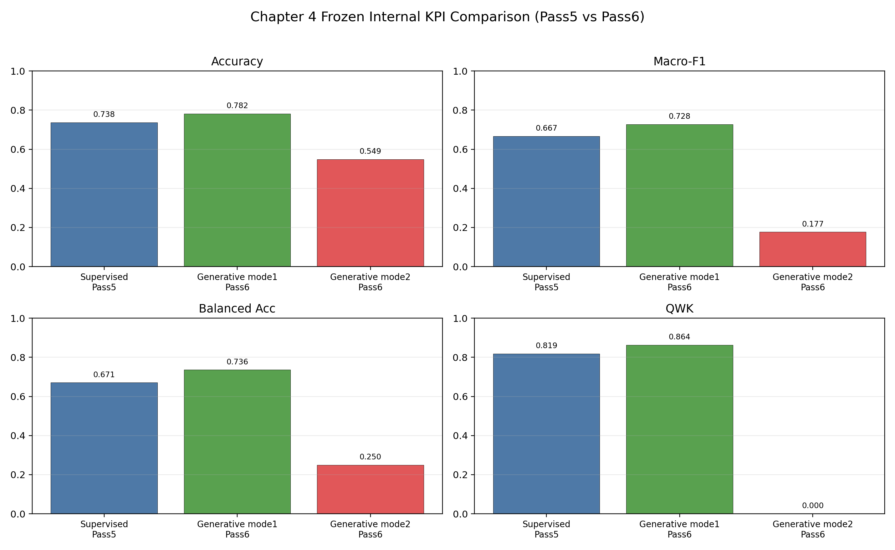
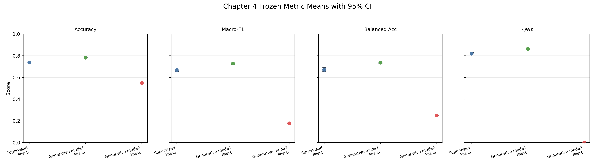
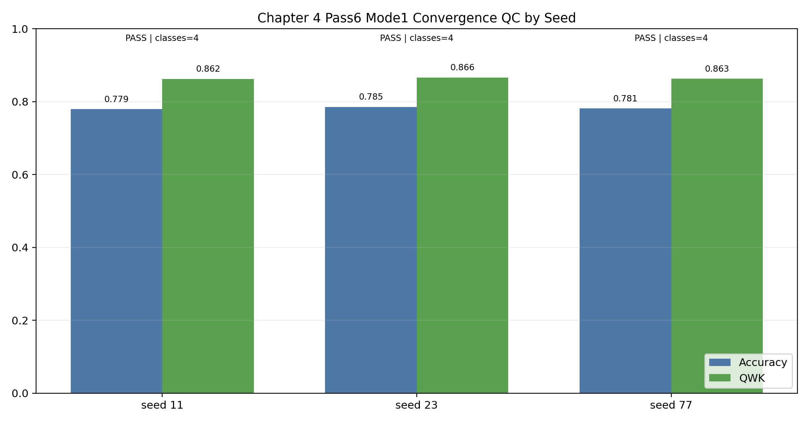
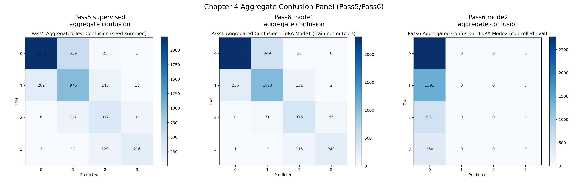
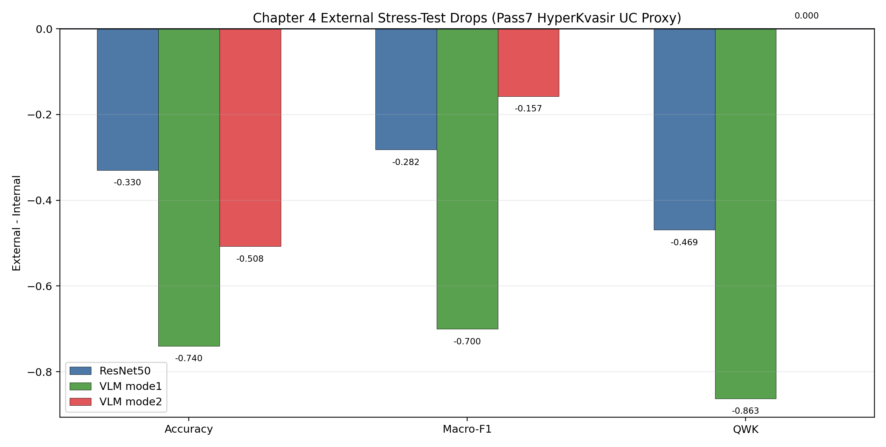

# Chapter 4: Developing the Proposed Approach

## 4.1 Chapter Overview and Methodological Rationale

Chapter 3 established the central empirical tension that motivates this chapter. Across multiple GI-endoscopy settings, constrained and supervised models were consistently more reliable than naive zero-shot vision-language prompting. That pattern was especially important for ulcerative colitis (UC) severity grading on LIMUC, where the task is clinically meaningful, ordinal in structure, and sensitive to class imbalance. The next methodological question is therefore not whether generation is possible, but whether a generative model can be adapted in a way that preserves the discipline of a classifier while retaining the flexibility of a language-based interface.

Chapter 4 addresses that question by developing a controlled severity-oriented pipeline for Mayo 0-3 scoring from colonoscopy frames. The chapter does not pursue unrestricted narrative generation. Instead, it treats generative modeling as a bounded decision mechanism: the model is required to produce a tightly constrained score output, its predictions are parsed under explicit rules, and its behavior is evaluated against strong supervised baselines under the same data split and reporting protocol. This framing is important because the dissertation is concerned with clinically usable multimodal systems rather than open-ended text production for its own sake.

The chapter has four objectives:

1. Define a reproducible UC severity task on LIMUC using fixed Mayo 0-3 labels and a fixed split structure.
2. Establish a strong supervised reliability anchor against which generative methods can be judged fairly.
3. Implement parameter-efficient adaptation of a vision-language model using LoRA so that score generation is learned rather than merely prompted.
4. Evaluate the resulting system with ordinal, class-balanced, and clinically interpretable metrics, while making the failure modes explicit.

The overall structure of the chapter follows that logic. Section 4.2 defines the dataset and claim boundary. Section 4.3 presents the proposed pipeline and explains the role of each modeling layer. Section 4.4 formalizes the evaluation protocol. Section 4.5 reports the internal and external results. Section 4.6 interprets those findings in relation to the broader dissertation argument, and Section 4.7 states the limitations that constrain the chapter's claims. The chapter concludes in Section 4.8 by positioning the resulting severity module as the upstream component for the evidence-grounded wrapper introduced in Chapter 5.

## 4.2 Dataset, Clinical Task, and Scope

The proposed approach is intentionally narrow in scope. Rather than attempting to solve general GI MedVQA in one step, this chapter focuses on a clinically bounded and measurable task: assigning a Mayo endoscopic severity score from a single colonoscopy frame. That choice keeps the experimental question well-defined and permits a direct comparison between discriminative and generative strategies on the same evidence base.

### 4.2.1 LIMUC as the Primary Evidence Base

The primary dataset for this chapter is LIMUC, which provides UC endoscopic imagery labeled with Mayo scores from 0 to 3. In clinical terms, this is an ordinal severity scale, not a nominal category set. Errors are therefore not all equally harmful: confusing Mayo 0 with Mayo 1 is different from confusing Mayo 0 with Mayo 3. This is one of the reasons Chapter 4 emphasizes ordinal metrics such as quadratic weighted kappa (QWK) alongside standard accuracy and F1 measures.

Within this repository, LIMUC preparation is handled through `Prototyping_reformat/DatasetAnalysis/LIMUC/0_dataset_prep/01_build_metadata_images_and_manifests.ipynb`, which produces the metadata tables and split manifests used throughout the chapter. The fixed metadata snapshot used here (`metadata_enriched.csv`) contains 11,276 frames.

**Table 4.1. LIMUC Split Distribution Used in Chapter 4**

| Split | Frames |
|---|---:|
| Train | 8,669 |
| Validation | 921 |
| Test | 1,686 |

**Table 4.2. LIMUC Mayo Class Distribution Across All Splits**

| Mayo class | Frames |
|---|---:|
| 0 | 6,105 |
| 1 | 3,052 |
| 2 | 1,254 |
| 3 | 865 |

Several properties of this distribution shape the methodological design. First, classes 0 and 1 dominate the dataset, while classes 2 and 3 are comparatively rare. Second, the task is ordinal, so adjacent-class confusion is more plausible than arbitrary misclassification. Third, the dataset is large enough to support supervised training, yet imbalanced enough that a simple accuracy-only reading would be misleading. For this reason, the proposed approach is evaluated with class-balanced and ordinal metrics, and the generative lane is trained with balanced sampling rather than naive frequency-following.

### 4.2.2 Scope Boundary for Chapter 4 Claims

The primary claims of Chapter 4 are deliberately restricted to internal LIMUC evaluation under the fixed split and reporting protocol described in this chapter. This means that the headline comparison is not between arbitrary best runs collected from different settings; it is a like-for-like comparison between a supervised baseline family and a generative adaptation family evaluated on the same internal task.

This boundary matters because several other datasets in the repository, including Kvasir-VQA, Kvasir-VQA-x1, and ImageCLEF MEDVQA-GI, are important for the dissertation as a whole but are not necessary to establish the core Chapter 4 claim. Their role is contextual and comparative, primarily in Chapters 2 and 3. Chapter 4, by contrast, is intentionally focused on a single clinically grounded severity problem so that the methodological contribution can be assessed cleanly.

The reporting policy follows the same logic. The primary optimization and reporting target is internal LIMUC `mode1/test` QWK. Accuracy, macro-F1, balanced accuracy, mean absolute error (MAE), root mean squared error (RMSE), and parse rate are reported as supporting metrics, but they do not override the ordinal agreement objective. This is appropriate because the Mayo task is inherently ordered and because clinically meaningful performance cannot be captured by raw accuracy alone.

### 4.2.3 External HyperKvasir UC Proxy Stress Test

In addition to the internal LIMUC evaluation, this chapter includes an external-only stress test based on a HyperKvasir-derived UC proxy set. The purpose of this evaluation is not to provide definitive generalization proof. Instead, it is used to test whether the internal gains observed on LIMUC survive a shift in data source, label compatibility, and output conditions.

The external protocol uses `metadata_hyperkvasir_uc_proxy_mayo_floor.csv`, which applies a floor-based mapping to interval labels. Specifically, interval findings are mapped as `0-1 -> 0`, `1-2 -> 1`, and `2-3 -> 2`. This mapping is useful for stress testing, but it is not equivalent to native Mayo annotation. The external set therefore functions as a robustness probe rather than a clinically final benchmark.

**Table 4.3. External HyperKvasir UC Proxy Distribution**

| Mayo proxy class | Frames |
|---|---:|
| 0 | 35 |
| 1 | 212 |
| 2 | 471 |
| 3 | 133 |

The total external set size is 851 frames. Two implications should be stated explicitly. First, the class profile differs materially from LIMUC, especially at the low-severity end. Second, the proxy mapping introduces label-space uncertainty that is absent from the internal dataset. For both reasons, external results are interpreted as limitation evidence and domain-shift analysis, not as the main basis for model selection.

## 4.3 Proposed Severity-Oriented Pipeline

The proposed Chapter 4 pipeline can be summarized as follows:

`dataset curation and split freezing -> supervised and generative baseline construction -> controlled severity prediction -> statistical evaluation -> error analysis`

The key design principle is that each stage should narrow the gap between flexible multimodal generation and clinically disciplined scoring. The pipeline is therefore built in layers, where each layer has a distinct role in separating genuine improvement from prompt-induced noise.

### 4.3.1 Data Preparation and Split Freezing

The first layer is the preparation layer implemented in `Prototyping_reformat/DatasetAnalysis/LIMUC/0_dataset_prep/01_build_metadata_images_and_manifests.ipynb`. Its purpose is not only to gather images and labels, but to create a reproducible task definition. The notebook generates metadata tables, split assignments, label mappings, and a split hash so that downstream experiments can be traced back to a fixed data state.

This step is methodologically important because later comparisons would be difficult to defend if the underlying train, validation, and test composition were allowed to drift. In a dissertation setting, reproducibility is not a convenience feature; it is part of the evidential argument. By freezing the metadata snapshot and the split structure before model comparison, the chapter avoids a common problem in multimodal experimentation where performance differences become entangled with unnoticed preprocessing changes.

### 4.3.2 Supervised Reliability Anchor

The second layer establishes a strong supervised anchor. This layer includes both frozen-encoder baselines and fine-tuned discriminative baselines. The frozen-encoder baselines are implemented in:

- `Prototyping_reformat/DatasetAnalysis/LIMUC/1_frozen_encoders/resnet50_frozen_logreg.ipynb`
- `Prototyping_reformat/DatasetAnalysis/LIMUC/1_frozen_encoders/vit_frozen_logreg.ipynb`
- `Prototyping_reformat/DatasetAnalysis/LIMUC/1_frozen_encoders/clip_linear_baseline.ipynb`

The fine-tuned baselines are implemented in:

- `Prototyping_reformat/DatasetAnalysis/LIMUC/2_supervised_finetuning/finetune_resnet50.ipynb`
- `Prototyping_reformat/DatasetAnalysis/LIMUC/2_supervised_finetuning/finetune_vit_or_swin.ipynb`

These baselines are not included merely for completeness. They define the minimum standard that any generative method must surpass to be taken seriously. In many medical-imaging settings, a generative system appears attractive because it produces human-readable text, yet still underperforms a simpler classifier on the actual decision variable of interest. By anchoring the chapter on supervised performance first, the proposed method is evaluated against the best currently justified alternative rather than against an artificially weak baseline.

### 4.3.3 Zero-Shot Generative Baseline

The third layer introduces a zero-shot generative severity baseline through `Prototyping_reformat/DatasetAnalysis/LIMUC/3_vlm_severity/vlm_zero_shot_mayo.ipynb`. This layer is important because it exposes the raw transfer gap between general multimodal fluency and clinically controlled severity scoring.

The zero-shot setup uses a fixed severity question prompt and expects a constrained textual output in the form `SCORE: X`, where `X` must belong to `{0,1,2,3}`. A strict parser then extracts the score and marks invalid or noncompliant generations explicitly. This design serves two functions. First, it gives the zero-shot model the best possible chance to succeed under a clear format. Second, it prevents the evaluation from rewarding free-form answers that sound plausible but cannot be mapped reliably to the task label space.

Zero-shot evaluation is therefore treated as a diagnostic baseline, not as the proposed solution. Its role is to show what prompt-only transfer can and cannot do before any in-domain adaptation is introduced.

### 4.3.4 Parameter-Efficient Generative Adaptation with LoRA

The central methodological contribution of this chapter is the parameter-efficient adaptation layer implemented in `Prototyping_reformat/DatasetAnalysis/LIMUC/3_vlm_severity/vlm_lora_finetune_mayo.ipynb`. This stage adapts a vision-language generation stack using Low-Rank Adaptation (LoRA) rather than full end-to-end retraining.

LoRA is appropriate here for both practical and scientific reasons. Practically, it reduces the memory and optimization cost of adapting a large multimodal model. Scientifically, it allows the chapter to test whether a large pretrained vision-language model can be made clinically useful for severity grading through targeted task adaptation rather than through unrestricted generation. The final architecture used in the comparison is BLIP2-Flan-T5-XL with LoRA adapters applied to the generative stack.

Two design choices are especially important. First, the target format is supervised explicitly so that the model learns to emit the severity token under a stable prefix rather than producing unconstrained prose. Second, the objective is label-token-focused, which reduces the incentive to learn decorative language that is irrelevant to the Mayo decision itself. In other words, the model is still generative at the interface level, but its training objective is deliberately aligned with a bounded clinical output.

### 4.3.5 Retrieval-Supported Extension Path

The repository also contains a retrieval-backed design pattern in `Prototyping_reformat/DatasetAnalysis/Kvasir_VQA_x1/2_modeling/09_rag_blip2_eval/01_rag_blip2_eval.ipynb`. That pattern is relevant to the broader dissertation because it anticipates evidence-grounded multimodal reasoning. However, it is not part of the primary Chapter 4 claim.

This exclusion is intentional. If retrieval support were added at the same time as severity adaptation, any improvement would become harder to attribute. Chapter 4 is therefore designed to answer a narrower question first: can a generative severity model outperform a strong supervised baseline on the internal task when the output space is tightly controlled? Only after that question is answered does the dissertation move, in Chapter 5, to the separate problem of evidence-grounded query support.

## 4.4 Experimental Design and Evaluation Protocol

The experimental design is structured to distinguish genuine task learning from output-format artifacts. Because the proposed method sits between classification and generation, the evaluation protocol must measure both predictive quality and output controllability.

### 4.4.1 Task Formulation and Output Modes

The input to the system is a single colonoscopy frame paired with a fixed severity question prompt. The required output is a Mayo score in the closed set `{0,1,2,3}`. Although the broader dissertation is interested in richer physician-facing interaction, the formal Chapter 4 task remains score prediction. Any optional evidence phrase is therefore treated as a deferred extension rather than a headline result.

Two evaluation lanes are used for the LoRA-adapted system:

1. `mode1` (`lora_mode1_train`): the model generates text under the constrained prompt format, after which a strict parser extracts `SCORE: <0|1|2|3>`.
2. `mode2` (`lora_mode2_eval`): the score is selected by candidate-label likelihood after the `SCORE:` prefix using a `sequence_logprob` strategy, without relying on free-text parsing.

These two lanes serve different purposes. `mode1` is the primary generative lane because it preserves a natural generation pathway while still enforcing explicit output control. `mode2` is a controlled ablation that removes free-text parsing and reduces the task to likelihood-based label selection. If `mode2` were to match or exceed `mode1`, the implication would be that free-text generation is unnecessary. If `mode2` fails, the implication is that the observed benefit comes from the adapted generation process rather than from a trivial label-probability shortcut.

### 4.4.2 Metric Bundle and Clinical Interpretation

No single metric is sufficient for this task. Chapter 4 therefore evaluates each lane using a bundle of complementary measures.

**Table 4.4. Metric Bundle Used for Chapter 4**

| Metric | Role in evaluation |
|---|---|
| Accuracy | Overall correctness across all test cases |
| Macro-F1 | Class-balanced discrimination under label imbalance |
| Balanced accuracy | Mean recall across classes, reducing majority-class dominance |
| QWK | Primary ordinal-agreement metric for Mayo 0-3 scoring |
| MAE / RMSE | Magnitude of ordinal error, penalizing distant mistakes |
| Per-class precision, recall, and F1 | Class-specific error interpretation |
| Parse rate | Validity of generative outputs under strict extraction |
| Remission-oriented slice (`0-1` vs `2-3`) | Clinically simplified threshold behavior |

QWK is the primary metric because it rewards correct ordinal agreement and penalizes distant disagreements more strongly than adjacent ones. This is better aligned with the severity task than plain accuracy. Macro-F1 and balanced accuracy are also essential because the dataset is imbalanced and a model that over-predicts common classes could achieve superficially acceptable accuracy while still failing on clinically important minority severities. Parse rate is included because a generative system cannot be considered reliable if its textual outputs cannot be converted back into a score consistently.

### 4.4.3 Reporting Policy, Statistical Checks, and Multi-Seed Aggregation

The chapter reports multi-seed aggregates rather than a single favorable run. This decision is especially important for the generative lane, where optimization variance can otherwise create misleading impressions of robustness. The supervised family is reported with seeds `11/23/42`, and the final generative family is reported with seeds `11/23/77`.

Confidence intervals are included for the key aggregate metrics, particularly QWK, so that the reader can judge whether apparent improvements are stable or merely within random variation. Where paired predictions are available, paired significance testing such as McNemar's test is used as an additional check. The chapter also includes a seed-level quality-control table for the mode1 generative lane, confirming that all reported runs converged non-degenerately and predicted all four classes.

This reporting policy reflects the evidential standard of the dissertation. The goal is not to maximize a single number under flexible conditions. The goal is to determine whether the proposed modeling strategy produces a stable, reproducible, and clinically interpretable improvement over the supervised anchor.

### 4.4.4 Final Training Configuration Used for Reporting

The official configurations used in the chapter are compiled from the persisted reporting artifacts in `Prototyping_reformat/DatasetAnalysis/LIMUC/4_reporting/out/`, specifically the multi-seed summaries for Pass 5 and Pass 6.

**Table 4.5. Final Configuration Summary for Reported Chapter 4 Results**

| Lane | Core setup |
|---|---|
| Pass 5 supervised | ResNet50 fine-tuning, seeds `11/23/42`, `15` epochs, batch size `16`, learning rate `3e-4`, weight decay `1e-4` |
| Pass 6 generative | BLIP2-Flan-T5-XL with LoRA, seeds `11/23/77`, `2` epochs, batch size `2`, gradient accumulation `4`, learning rate `5e-5`, LoRA `r=8`, `alpha=16`, dropout `0.1`, balanced sampling, label-token-only objective |

The asymmetry between the supervised and generative configurations is expected rather than problematic. The models belong to different families and have different optimization constraints. The important point is not that they use identical hyperparameters, but that each family is trained under a reasonable and fixed protocol, and that the final comparison is based on the resulting multi-seed aggregates rather than on cherry-picked exceptions.

## 4.5 Results

All reported values in this section are compiled from the persisted LIMUC reporting outputs under `Prototyping_reformat/DatasetAnalysis/LIMUC/4_reporting/out/` and the synchronized chapter tables under `Thesis/markdown/figures/ch4_representations/`. The chapter interpretation below is restricted to those fixed results.

### 4.5.1 Internal Multi-Seed Comparison on LIMUC

The main result of Chapter 4 is that the LoRA-adapted generative lane (`mode1`) outperforms the official supervised baseline on the internal LIMUC test set across every headline metric that matters for this task.

**Table 4.6. Internal Multi-Seed Results on LIMUC**

| Lane | Seeds | Accuracy | Macro-F1 | Balanced accuracy | QWK | 95% CI (QWK) | Parse rate |
|---|---|---:|---:|---:|---:|---|---:|
| Pass 5 supervised | 11/23/42 | 0.737643 | 0.667330 | 0.670907 | 0.818649 | [0.807920, 0.830582] | -- |
| Pass 6 `lora_mode1_train` | 11/23/77 | 0.781930 | 0.727920 | 0.736292 | 0.863656 | [0.862382, 0.865836] | 1.000000 |
| Pass 6 `lora_mode2_eval` | 11/23/77 | 0.548636 | 0.177135 | 0.250000 | 0.000000 | [0.000000, 0.000000] | 1.000000 |

Relative to the supervised baseline, `mode1` improves internal QWK by `+0.045007`, macro-F1 by `+0.060590`, balanced accuracy by `+0.065385`, and accuracy by `+0.044286`. At the same time, it preserves a parse rate of `1.000000`, meaning that every generated answer in the reported internal evaluation remained convertible to a valid score. This is a critical result because it shows that the proposed method does not trade improved scoring for unstable text output. Instead, it achieves both better ordinal agreement and perfect format compliance under the constrained protocol.

The narrow QWK confidence interval for `mode1` also suggests stable multi-seed behavior. This is supported by the seed-level quality-control record, where all three reported runs pass the non-degeneracy checks and each run predicts all four classes. In contrast, `mode2` performs poorly despite also achieving a parse rate of `1.000000`. This immediate contrast shows that syntactic validity alone is not sufficient; the model must also preserve meaningful class discrimination.

*Figure 4.1 highlights the headline internal result: the LoRA-adapted `mode1` lane exceeds the supervised baseline, while the `mode2` ablation collapses despite perfect parse compliance.*

*Figure 4.2 shows that the `mode1` advantage is not limited to one metric. The improvement is coherent across accuracy, macro-F1, balanced accuracy, and QWK.*

*Figure 4.3 documents run stability for the reported generative lane. The legacy filename is preserved for reproducibility, but the figure is used here as a seed-level quality-control view rather than as a headline significance display.*

### 4.5.2 Class-Wise Behavior and Error Structure

Aggregate improvement is important, but it does not by itself show where the gains come from. The class-wise recall summary indicates that `mode1` improves recall for every Mayo class and is especially stronger on the more difficult higher-severity classes.

**Table 4.7. Mean Per-Class Recall on LIMUC**

| Mayo class | Pass 5 supervised | Pass 6 `mode1` | Absolute gain |
|---|---:|---:|---:|
| 0 | 0.8043 | 0.8346 | +0.0303 |
| 1 | 0.7011 | 0.7349 | +0.0338 |
| 2 | 0.5782 | 0.7062 | +0.1281 |
| 3 | 0.6000 | 0.6694 | +0.0694 |

The largest gain appears in Mayo class 2, where recall rises from approximately `0.5782` to `0.7062`. This is a substantial improvement because class 2 occupies a clinically meaningful middle-to-high severity region and is often vulnerable to confusion with adjacent classes. Class 3 also improves noticeably, indicating that the proposed generative adaptation is not merely optimizing for the dominant remission or low-severity cases.

At the same time, the class-wise profile confirms that the task remains difficult. The improvement does not eliminate adjacent-boundary ambiguity, especially between neighboring severity levels. This is consistent with the visual nature of the problem, where subtle mucosal differences and frame-level ambiguity can make strict categorical separation inherently challenging.

The `mode2` ablation clarifies the failure mode even more sharply. Its class-wise recall profile is `1.0` for class 0 and `0.0` for classes 1, 2, and 3, indicating an effective collapse into majority-class prediction. That pattern explains why `mode2` can preserve perfect parse rate while still reaching `QWK = 0.0`: the model is producing valid labels, but those labels are clinically uninformative because the ordinal structure has collapsed.

*Figure 4.4 visualizes the error structure behind the aggregate metrics. The `mode1` lane reduces confusion more evenly across classes, whereas `mode2` degenerates into a class-0-dominant pattern.*

### 4.5.3 External Stress Test Under Domain Shift

The internal LIMUC improvement is not automatically evidence of broader robustness. For that reason, the chapter includes an external-only HyperKvasir UC proxy evaluation as a stress test.

**Table 4.8. Internal-to-External Performance Shift**

| Lane | Internal QWK | External QWK | Delta (external-internal) | Internal parse rate | External parse rate |
|---|---:|---:|---:|---:|---:|
| `resnet50_supervised` | 0.828762 | 0.359597 | -0.469165 | -- | -- |
| `vlm_lora_mode1` | 0.862752 | 0.000000 | -0.862752 | 1.0 | 0.0 |
| `vlm_lora_mode2` | 0.000000 | 0.000000 | 0.000000 | 1.0 | 1.0 |

The external results are poor for all model families, but the failure pattern differs by lane. The supervised ResNet50 baseline degrades substantially, yet still retains non-zero external agreement (`QWK = 0.359597`). The `mode1` generative lane, by contrast, collapses almost completely under this proxy setting: external accuracy falls to `0.041128`, macro-F1 to `0.019752`, QWK to `0.0`, and parse rate to `0.0`. This means that under the external proxy condition the model does not merely become less accurate; it stops emitting outputs that can be parsed as valid scores at all.

This is an important negative result. It indicates that the internal success of the proposed generative lane is real but not yet domain-robust. The likely causes are a combination of dataset shift, label-space mismatch introduced by the proxy mapping, and output-style fragility when the visual distribution no longer matches the in-domain training regime. The `mode2` lane remains degenerate internally and externally, which reinforces the interpretation that it is not a viable alternative scoring strategy under the present design.

*Figure 4.5 summarizes the scale of the external degradation. The figure should be read as robustness-limitation evidence rather than as a contradiction of the internal LIMUC improvement.*

## 4.6 Discussion

The results support a precise conclusion: a vision-language model can outperform a strong supervised baseline on internal UC severity grading when its generation is adapted to the task through parameter-efficient training and constrained output design. This is not evidence that unrestricted multimodal generation is superior to classification. It is evidence that a carefully controlled generative interface can function as an effective ordinal scorer when the task, output space, and training objective are tightly aligned.

### 4.6.1 Why the Adapted Generative Lane Improves Internal Severity Grading

The `mode1` lane succeeds because it combines three properties that are often separated in the MedVQA literature. First, it retains the representational capacity of a large pretrained vision-language model. Second, it is adapted in-domain rather than prompted naively. Third, its output behavior is constrained strongly enough that the model is rewarded for emitting the clinically relevant decision token rather than for producing fluent but task-irrelevant text.

This combination appears to matter particularly for the minority and higher-severity classes. The class-wise recall gains suggest that the LoRA-adapted model is not simply memorizing majority labels more effectively than the supervised baseline. Instead, it seems to learn a better ordering-sensitive decision surface for the four Mayo categories under the fixed prompt format. That is the key methodological result of the chapter.

### 4.6.2 Why the Likelihood-Only Lane Fails

The failure of `mode2` is just as informative as the success of `mode1`. In principle, likelihood-based label selection after a fixed prefix could have offered a cleaner and more classifier-like use of the generative backbone. In practice, it collapses to majority behavior. The saved class-wise recall profile shows that `mode2` effectively predicts class 0 only, which is enough to preserve superficial syntax but destroys clinical utility.

This negative result illustrates a broader thesis point: stricter output control is not automatically better if it removes the mechanism through which the adapted model expresses the decision boundary it has learned. A clinically useful generative system must be controlled, but the form of control must still allow task-relevant discrimination. `Mode1` achieves that balance under the internal protocol; `mode2` does not.

### 4.6.3 Implications for the Broader Dissertation

The broader significance of Chapter 4 is methodological. It shows that the path from benchmark MedVQA to clinically usable multimodal systems does not run through unconstrained prompting. Instead, it requires bounded task design, explicit evaluation of output validity, and comparison against strong supervised anchors. In that sense, Chapter 4 is the bridge between the diagnostic benchmarking of Chapter 3 and the physician-facing wrapper of Chapter 5.

The chapter also clarifies what kind of generative model is worth carrying forward. The severity component advanced from Chapter 4 is not a general-purpose conversational model. It is a controlled upstream module whose job is to convert an image into a stable severity signal under explicit formatting rules. That is precisely the kind of component that can be embedded safely into a larger evidence-grounded decision-support pipeline.

## 4.7 Limitations and Claim Boundary

Several limitations constrain the interpretation of the results and should be stated explicitly in the dissertation text.

1. The task is frame-based rather than procedure-based. A single image can support severity estimation, but it is not equivalent to full-video or full-case clinical assessment.
2. Class-boundary ambiguity remains a persistent source of error, especially for adjacent Mayo categories such as `0 <-> 1` and `1 <-> 2`.
3. The `mode2` lane fails under the present design and should be treated as a negative-result ablation rather than as a viable alternative deployment mode.
4. The external HyperKvasir UC proxy evaluation uses mapped interval labels rather than native Mayo annotation. Its results are therefore informative for robustness analysis but insufficient for deployment claims.
5. Although `mode1` improves internal QWK to `0.863656`, the result remains below a `0.90` threshold and therefore still leaves meaningful headroom for future improvement.
6. Structured outputs that combine `Mayo + evidence phrase` are not part of the headline claim in this chapter. The contribution established here is limited to controlled severity scoring.

Accordingly, the central claim of Chapter 4 should be read narrowly and precisely: under the fixed internal LIMUC protocol, the LoRA-adapted generative `mode1` lane exceeds the official supervised baseline on ordinal and class-balanced severity metrics while maintaining perfect parse compliance. The chapter does not claim external deployment readiness, general GI reasoning competence, or robust cross-domain severity transfer.

## 4.8 Chapter Summary and Transition to Chapter 5

Chapter 4 transformed the diagnostic findings of Chapter 3 into a concrete proposed method. Using LIMUC as the primary evidence base, the chapter defined a reproducible Mayo 0-3 severity task, established a strong supervised anchor, implemented a LoRA-adapted vision-language severity model, and evaluated it under a controlled multi-seed protocol. The main empirical result is clear: on internal LIMUC, the generative `mode1` lane improves on the supervised baseline in QWK, macro-F1, balanced accuracy, and accuracy while preserving perfect parse validity. At the same time, the external stress test shows that this gain should be interpreted as in-domain improvement rather than as generalization proof.

This outcome provides the exact kind of upstream component needed for the next stage of the dissertation. Chapter 5 takes the severity signal developed here as a fixed input and places it inside a physician-facing wrapper that adds PICO extraction, retrieval grounding, citation linkage, and safety constraints. In other words, Chapter 4 solves the bounded severity-estimation problem; Chapter 5 asks how that bounded signal can be integrated into a more traceable and clinically useful multimodal interaction layer.
