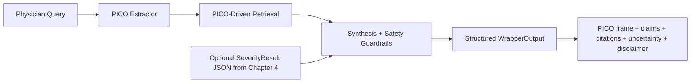
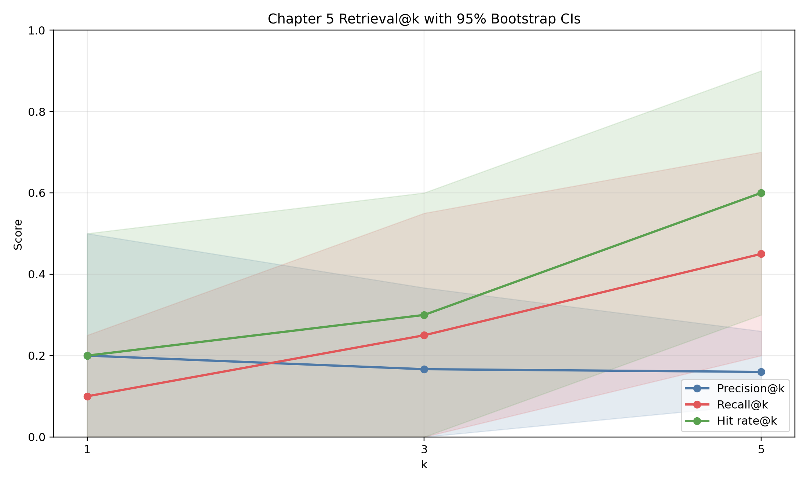
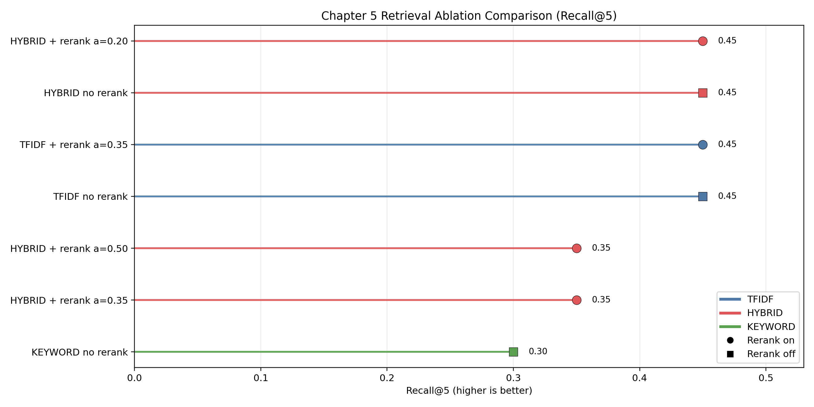
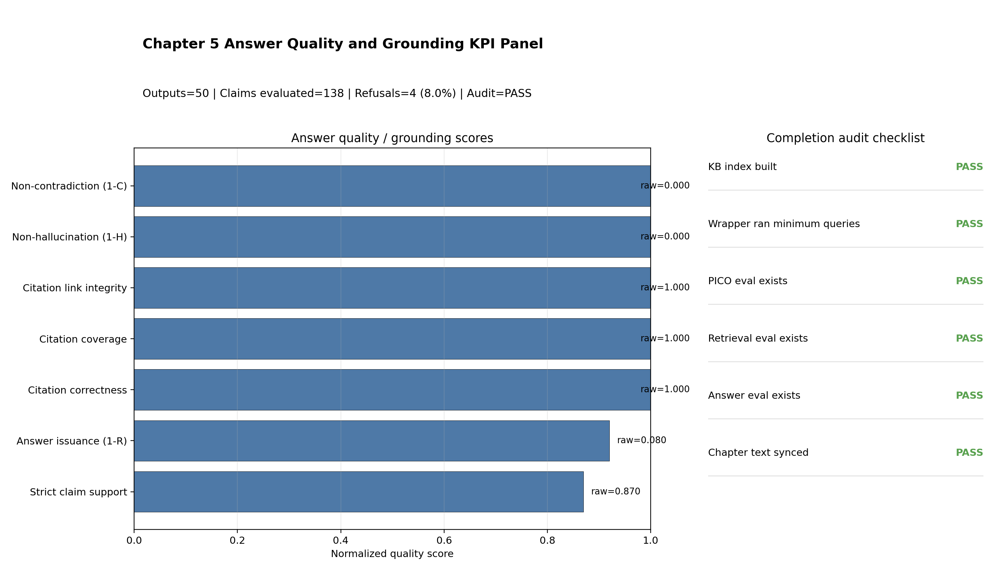

# Chapter 5: PICO-Grounded GenAI Wrapper for Physician Query Support

## 5.1 Chapter Purpose and Contribution

Chapter 4 established a frozen, reproducible ulcerative colitis (UC) severity component under explicit claim boundaries. Chapter 5 extends that work into a physician-query wrapper that is designed for traceable decision support, not autonomous recommendation.

The chapter contribution is practical and system-level:

1. convert physician-style queries into structured PICO fields;
2. retrieve evidence chunks conditioned on PICO intent;
3. synthesize citation-linked claims under explicit safety rules;
4. preserve compatibility with frozen Chapter 4 severity context via typed schemas;
5. provide reproducible evaluation and completion-audit artifacts.

## 5.2 Boundary Conditions from Chapter 4 Freeze

Chapter 5 is explicitly downstream of the Chapter 4 freeze package:

- `CH4_PART1_SCOPE_FREEZE_20260306.md`
- `CH4_PART2_REPRO_FREEZE_20260306.md`
- `CH4_PART7_DISSERTATION_READINESS_GATE_20260306.md`
- `Prototyping_reformat/DatasetAnalysis/LIMUC/4_reporting/out/pass6_generative_metric_summary.csv`

For cross-chapter consistency, the upstream severity boundary in this chapter aligns to the frozen Pass 5/6/7 reporting policy in Chapter 4 (not exploratory runs). The official internal Chapter 4 reference points used here are:

| Upstream lane (Chapter 4) | Accuracy | Macro-F1 | Balanced accuracy | QWK | Parse rate |
|---|---:|---:|---:|---:|---:|
| Pass 5 supervised | 0.737643 | 0.667330 | 0.670907 | 0.818649 | -- |
| Pass 6 mode1 (primary generative lane) | 0.781930 | 0.727920 | 0.736292 | 0.863656 | 1.000000 |
| Pass 6 mode2 (negative ablation) | 0.548636 | 0.177135 | 0.250000 | 0.000000 | 1.000000 |

In the Chapter 5 pass4 wrapper evaluation run, severity context ingestion is supported by schema (`SeverityResult`) but intentionally disabled for the reported benchmark pass (`has_severity_context=false`) to isolate wrapper behavior.

## 5.3 Design Objectives and Non-Objectives

### 5.3.1 Design objectives

1. enforce structured outputs with explicit claims and citations;
2. keep failure behavior visible (refusal/escalation instead of fabricated confidence);
3. preserve deterministic, local reproducibility without external API dependence;
4. keep module boundaries clear so the wrapper can be audited independently of Chapter 4 retraining.

### 5.3.2 Non-objectives in this chapter

1. no patient-specific dosing recommendation generation;
2. no claim of external clinical deployment readiness;
3. no replacement of physician judgement;
4. no claim that current internal KB coverage approximates guideline-complete retrieval.

## 5.4 System Architecture and Contracts

### 5.4.1 End-to-end processing flow



### 5.4.2 Module-level implementation map

Code root: `Prototyping_reformat/chapter5_pico_wrapper/pico_wrapper/`.

| Module | Responsibility |
|---|---|
| `schemas.py` | Typed contracts (`PicoFrame`, `SeverityResult`, `EvidenceChunk`, `Citation`, `WrapperInput`, `WrapperOutput`) |
| `pico_extract.py` | Rule-based PICO extraction with optional LLM hook and safe fallback |
| `kb_ingest.py` | KB ingestion, chunking, and index metadata generation |
| `retriever.py` | Backend-aware retrieval with PICO-conditioned query composition |
| `synthesis.py` | Deterministic claim synthesis and citation attachment |
| `safety.py` | Refusal/escalation policy and disclaimer enforcement |
| `wrapper.py` | Full pipeline orchestration (`extract -> retrieve -> synthesize`) |
| `ui_support.py` | UI-side formatting and report helpers |

### 5.4.3 Retrieval/index design used in frozen Chapter 5 pass

From `Prototyping_reformat/chapter5_pico_wrapper/results/kb_build_pass4_latest/kb_manifest.json`:

- source files: `3`
- documents: `3`
- chunks: `12`
- chunking: `max_words=180`, `overlap_words=30`, `min_words=30`, `seed=42`
- backend family available: `keyword`, `tfidf`, `semantic_lsa`, `hybrid`
- pass4 reporting backend: `hybrid` with reranker enabled.

### 5.4.4 Safety policy implementation

The wrapper applies explicit safety constraints:

1. dosing-sensitive prompts can trigger refusal behavior;
2. low-evidence retrieval paths trigger conservative uncertainty/limitation text;
3. all outputs include clinician-review disclaimers;
4. policy-excluded claims are tracked separately in answer evaluation.

## 5.5 Experimental Protocol and Frozen Artifacts

### 5.5.1 Query and gold sets

From `Prototyping_reformat/chapter5_pico_wrapper/data/queries/`:

- `queries.jsonl`: `n=50`
- `pico_gold.jsonl`: `n=20`
- `retrieval_gold.jsonl`: `n=10`

### 5.5.2 Frozen pass used for chapter reporting

This chapter reports the pass4 artifact set to remain consistent with completion audit and figure pipeline:

- KB: `results/kb_build_pass4_latest/`
- wrapper outputs: `results/wrapper_eval_pass4_latest/`
- wrapper output file: `Prototyping_reformat/chapter5_pico_wrapper/results/wrapper_eval_pass4_latest/wrapper_outputs.jsonl`
- evaluations: `results/eval_pass4_latest/`
- completion audit: `results/chapter5_completion_audit_ch5_freeze_20260306/`
- pipeline summary: `results/pipeline_pass4_latest/pipeline_summary.json`

Key wrapper config (`results/wrapper_eval_pass4_latest/run_config.json`):

| Parameter | Value |
|---|---|
| `run_id` | `chapter5_wrapper_20260305T024427Z_6nx5r2` |
| `mode_requested` | `baseline` |
| `n_queries` | `50` |
| `retrieval_k` | `5` |
| `retrieval_backend` | `hybrid` |
| `rerank_enabled` | `true` |
| `rerank_pool` | `20` |
| `rerank_alpha` | `0.2` |
| `min_top_score_for_answer` | `0.18` |
| `min_mean_score_for_answer` | `0.12` |
| `min_retrieved_for_answer` | `2` |
| `has_severity_context` | `false` |

### 5.5.3 One-command reproducibility path

The canonical local pipeline command:

```bash
python Prototyping_reformat/chapter5_pico_wrapper/scripts/run_full_pipeline.py --tag pass4_latest
```

This executes:

1. query/gold generation,
2. KB build,
3. wrapper run,
4. PICO evaluation,
5. retrieval evaluation (with bootstrap CIs),
6. answer evaluation (including strict support),
7. completion audit generation.

## 5.6 Results

### 5.6.1 PICO extraction quality

Source: `Prototyping_reformat/chapter5_pico_wrapper/results/eval_pass4_latest/pico_eval.json`.

| Field | Precision | Recall | F1 |
|---|---:|---:|---:|
| Population | 1.0000 | 1.0000 | 1.0000 |
| Intervention | 0.6250 | 1.0000 | 0.7692 |
| Comparator | 0.8800 | 1.0000 | 0.9362 |
| Outcomes | 0.4000 | 0.5000 | 0.4444 |
| Severity anchors | 0.4667 | 1.0000 | 0.6364 |
| Timeframe | 1.0000 | 1.0000 | 1.0000 |
| Setting | 0.8000 | 0.5000 | 0.6154 |
| Constraints | 0.0000 | 0.0000 | 0.0000 |

Aggregate values:

- required-field macro-F1 (`P/I/C/O + severity_anchors`): `0.7572` (`n=20`)
- all-field macro-F1: `0.6752`

The extractor is recall-heavy for core required fields but has precision weakness in outcomes and severity anchors, indicating broad lexical matching behavior.


*Per-field PICO extraction scores; shaded groups in the figure indicate required fields.*

### 5.6.2 Retrieval quality and uncertainty

Source: `Prototyping_reformat/chapter5_pico_wrapper/results/eval_pass4_latest/retrieval_eval.json`.

| Metric | @1 | @3 | @5 |
|---|---:|---:|---:|
| Precision@k | 0.2000 | 0.1667 | 0.1600 |
| Recall@k | 0.1000 | 0.2500 | 0.4500 |
| Hit rate@k | 0.2000 | 0.3000 | 0.6000 |

Bootstrap 95% confidence intervals (`2000` iterations, `seed=42`):

| Metric | @1 CI | @3 CI | @5 CI |
|---|---|---|---|
| Precision@k | [0.00, 0.50] | [0.00, 0.3667] | [0.08, 0.26] |
| Recall@k | [0.00, 0.25] | [0.00, 0.55] | [0.20, 0.70] |
| Hit rate@k | [0.00, 0.50] | [0.00, 0.60] | [0.30, 0.90] |

Interpretation: top-5 retrieval gives workable coverage on the current small KB, but wide intervals reflect small retrieval-gold sample size (`n=10`).



*Retrieval precision/recall/hit-rate profiles with uncertainty bands.*

### 5.6.3 Retrieval ablation (backend/rerank sensitivity)

Source: `Prototyping_reformat/chapter5_pico_wrapper/results/eval_pass3_ablation/retrieval_ablation_summary.tsv`.

| Case | Backend | Rerank | Alpha | Hit@1 | Hit@5 | Recall@5 |
|---|---|---|---:|---:|---:|---:|
| `keyword_no_rerank` | keyword | no | 0.35 | 0.20 | 0.50 | 0.30 |
| `hybrid_rerank_a035` | hybrid | yes | 0.35 | 0.20 | 0.50 | 0.35 |
| `hybrid_rerank_a050` | hybrid | yes | 0.50 | 0.20 | 0.50 | 0.35 |
| `tfidf_no_rerank` | tfidf | no | 0.35 | 0.10 | 0.60 | 0.45 |
| `tfidf_rerank_a035` | tfidf | yes | 0.35 | 0.20 | 0.60 | 0.45 |
| `hybrid_no_rerank` | hybrid | no | 0.35 | 0.20 | 0.60 | 0.45 |
| `hybrid_rerank_a020` | hybrid | yes | 0.20 | 0.20 | 0.60 | 0.45 |

Selected default in pass4: `hybrid + rerank alpha=0.20`, which ties best `Recall@5` while preserving stronger `Hit@1` than non-reranked TF-IDF.



*Recall@5 comparison across backend/rerank configurations; multiple settings tie at the top in this small benchmark.*

### 5.6.4 Answer quality and citation grounding

Source: `Prototyping_reformat/chapter5_pico_wrapper/results/eval_pass4_latest/answer_eval.json`.

| Metric | Value |
|---|---:|
| Outputs evaluated | 50 |
| Claims extracted | 142 |
| Claims evaluated | 138 |
| Policy claims excluded | 4 |
| Refusal count | 4 |
| Refusal rate | 0.0800 |
| Citation coverage | 1.0000 |
| Citation correctness (heuristic) | 1.0000 |
| Claim support (heuristic) | 1.0000 |
| Claim support (strict) | 0.8696 |
| Contradiction proxy | 0.0000 |
| Hallucination proxy | 0.0000 |
| Citation link integrity | 1.0000 |

Strict support is intentionally harder than the heuristic overlap checks (`min_overlap_ratio=0.25`, `min_overlap_terms=3`), providing a tighter baseline for future manual review.



*Composite panel with answer KPIs, refusal rate, and completion audit checklist status.*

## 5.7 Error Analysis and Observed Failure Modes

The pass4 evidence indicates several recurring failure modes:

1. **Outcome extraction over-triggering:** `outcomes` precision (`0.4000`) is substantially lower than recall (`0.5000`), suggesting lexical over-coverage.
2. **Severity-anchor over-triggering:** `severity_anchors` recall is high (`1.0000`) but precision is low (`0.4667`), reflecting broad term matching.
3. **Top-rank retrieval fragility:** recall improves with larger `k`, but top-1 behavior remains brittle (`Recall@1=0.1000`).
4. **Evidence-threshold sensitivity:** strict claim-support scoring (`0.8696`) is lower than heuristic support (`1.0000`), showing dependence on overlap thresholds.
5. **Policy handling effects:** refusals are necessary for safety but reduce answer issuance rate (`92%` non-refusal issuance).

These effects are expected for a baseline that prioritizes traceability and deterministic behavior over free-form fluency.

## 5.8 Threats to Validity and Limitations

1. **Small KB footprint:** only `3` source documents and `12` chunks limit retrieval diversity.
2. **Synthetic/small evaluation subsets:** retrieval gold (`n=10`) and PICO gold (`n=20`) are useful for method checks, not broad clinical generalization.
3. **Heuristic grounding metrics:** citation correctness and hallucination proxies are lexical and must be complemented by clinician semantic review.
4. **No external API LLM dependency in baseline:** improves reproducibility but does not yet benchmark richer model-assisted synthesis.
5. **No deployment claim:** this chapter demonstrates engineering feasibility and reproducibility, not bedside readiness.

## 5.9 Reproducibility and Completion Audit Status

Completion audit source:

- `Prototyping_reformat/chapter5_pico_wrapper/results/chapter5_completion_audit_ch5_freeze_20260306/chapter5_completion_report.json`
- `Prototyping_reformat/chapter5_pico_wrapper/results/chapter5_completion_audit_ch5_freeze_20260306/chapter5_completion_report.md`

Audit status: `PASS` (`6/6` checklist items passed), including artifact existence, minimum query coverage, and chapter-text synchronization checks.

Core scripts:

- `scripts/build_kb.py`
- `scripts/make_queryset.py`
- `scripts/run_wrapper.py`
- `scripts/run_ui.py`
- `scripts/eval_pico.py`
- `scripts/eval_retrieval.py`
- `scripts/eval_answers.py`
- `scripts/chapter5_completion_audit.py`
- `scripts/run_full_pipeline.py`

## 5.10 Chapter 5 Claim Guardrail

Allowed headline claims:

1. Chapter 5 provides a reproducible, citation-aware wrapper around frozen upstream Chapter 4 severity capability.
2. Required-field PICO extraction and top-5 retrieval show workable baseline behavior on internal benchmark artifacts.
3. Citation-linked synthesis and refusal handling are operational in pass4 and auditable from persisted outputs.

Disallowed headline claims:

1. Do not claim external clinical deployment readiness from the current internal KB and synthetic/small gold subsets.
2. Do not present retrieval or grounding heuristics as a substitute for clinician semantic adjudication.
3. Do not interpret this chapter as replacing Chapter 4 severity model validation.

## 5.11 Chapter Summary and Transition

Chapter 5 delivers a complete PICO-grounded wrapper layer that is structured, safety-constrained, and reproducibility-first. The wrapper does not attempt to hide uncertainty; it surfaces citations, supports refusal behavior, and exposes clear artifact trails for audit.

Relative to a monolithic end-to-end generator, the chapter demonstrates a modular path: frozen visual severity evidence (Chapter 4) plus explicit retrieval-grounded synthesis control. The next dissertation step is to extend this baseline with larger curated evidence stores, stronger retrieval supervision, and clinician-scored semantic grounding studies.

## 5.12 Consolidated Delivery Record (Parts 1-8)

This section consolidates all Chapter 5 completion work into this single dissertation source file.
Use this file as the Chapter 5 single source of truth for writing and final edits.

### 5.12.1 Part-by-Part completion summary

| Part | Date | Output artifact | Status | Dissertation-relevant outcome |
|---|---|---|---|---|
| Part 1 | 2026-03-06 | `CH5_PART1_SCOPE_FREEZE_20260306.md` | Complete | Locked Chapter 5 KPI bundle and claim boundary. |
| Part 2 | 2026-03-06 | `CH5_PART2_REPRO_FREEZE_20260306.md` | Complete | Repo/code/data freeze documented with command provenance. |
| Part 3 | 2026-03-06 | `CH5_PART3_WRITING_PACK_20260306.md`, `CH5_PART3_ASSET_MANIFEST_20260306.csv` | Complete | Writing pack and citation-ready asset map prepared with frozen values. |
| Part 4 | 2026-03-06 | `CH5_PART4_CHAPTER_TEXT_SYNC_20260306.md` | Complete | Chapter 5 narrative synchronized to pass4 evidence boundary. |
| Part 5 | 2026-03-06 | `CH5_PART5_FIGURE_SYNC_20260306.md` | Complete | Figure/data synchronization for `F07` to `F10` confirmed. |
| Part 6 | 2026-03-06 | `CH5_PART6_CHAPTER_FIGURE_INSERT_SYNC_20260306.md` | Complete | Inserted `F07` to `F10` into Chapter 5 markdown text. |
| Part 7 | 2026-03-06 | `CH5_PART7_DISSERTATION_READINESS_GATE_20260306.md` | Complete | Readiness gate passed: numeric/path/figure consistency checks. |
| Part 8 | 2026-03-06 | `CH5_PART8_FINAL_WRITING_PASS_20260306.md` | Complete | Final dissertation-style writing pass delivered. |

### 5.12.2 Frozen headline results (official)

- PICO required-field macro-F1: `0.7572418125609615` (`n=20`)
- Retrieval @5: precision `0.1600`, recall `0.4500`, hit rate `0.6000` (`n=10`)
- Answer layer: citation coverage `1.0000`, strict support `0.8695652173913043`, hallucination proxy `0.0000`, contradiction proxy `0.0000`, refusals `4/50`
- Completion audit: `PASS` (`6/6`) from `chapter5_completion_audit_ch5_freeze_20260306`

### 5.12.3 Claim guardrail (locked)

Allowed headline claims:
1. Chapter 5 wrapper behavior is reproducible and auditable under frozen pass4 artifacts.
2. PICO extraction + retrieval + citation-grounded synthesis are operational with explicit safety behavior.
3. Chapter 5 remains a controlled downstream evidence layer to frozen Chapter 4 boundaries.

Disallowed headline claims:
1. Do not claim external deployment readiness.
2. Do not treat heuristic grounding metrics as clinician-equivalent adjudication.
3. Do not mix non-frozen artifact sets into headline tables.

### 5.12.4 Reproducibility freeze snapshot

- Freeze timestamp (UTC): `2026-03-06T17:54:37Z`
- Branch at freeze: `LIMUC`
- Commit at freeze: `29ea484bb90fb43dd24c4ac1c0dc7b3bda436d21`
- Queryset hashes:
  - `queries.jsonl`: `35c538281774cefae5893006f68045bcaff47579a67baa52f8d6ecc6a3e79fc8`
  - `pico_gold.jsonl`: `48588d874e41f3d6bd875460e46e1cf9a11fb615a8e170c8b43dca303cd3b4ae`
  - `retrieval_gold.jsonl`: `5dbb279a2f2abb227843980d853163a6cc61ec5047e4c0a5323c8830f7e756f4`

## 5.13 Chapter 5 Representation Pack (What, Where, Aim)

All Chapter 5 representations are consolidated under:
- `Thesis/markdown/figures/ch5_representations/`

### 5.13.1 Main-text representations

| Rep ID | File | Where to place/use | Aim of representation |
|---|---|---|---|
| R5.1 | `F07_ch5_pico_field_precision_recall_f1.png` | Section `5.6.1` | Show fieldwise PICO extraction strengths and weaknesses. |
| R5.2 | `F08_ch5_retrieval_at_k_curve_with_ci.png` | Section `5.6.2` | Show retrieval behavior by k with uncertainty intervals. |
| R5.3 | `F09_ch5_retrieval_ablation_comparison.png` | Section `5.6.3` | Show backend/rerank sensitivity in retrieval quality. |
| R5.4 | `F10_ch5_answer_quality_grounding_kpi_panel.png` | Section `5.6.4` | Summarize grounding KPIs with audit checklist status. |

### 5.13.2 Table/data representations

| Rep ID | File | Where to place/use | Aim of representation |
|---|---|---|---|
| R5.5 | `pico_eval.json` | Table source for `5.6.1` | Canonical PICO extraction metrics. |
| R5.6 | `retrieval_eval.json` | Table source for `5.6.2` | Canonical retrieval metrics + CIs. |
| R5.7 | `answer_eval.json` | Table source for `5.6.4` | Canonical answer-grounding/safety metrics. |
| R5.8 | `retrieval_ablation_summary.tsv` | Table source for `5.6.3` | Retrieval ablation baseline/supporting results. |
| R5.9 | `wrapper_run_config.json` | Protocol source for `5.5.2` | Frozen wrapper configuration reference. |
| R5.10 | `kb_manifest.json` | Protocol source for `5.4.3` | Frozen KB/index profile reference. |
| R5.11 | `chapter5_completion_report.json` | Gate source for `5.9` | Completion-audit pass evidence. |
| R5.12 | `pipeline_summary.json` | Protocol source for `5.5.3` | End-to-end command provenance. |

### 5.13.3 Supplemental figure-source tables

| Rep ID | File | Aim |
|---|---|---|
| R5.13 | `ch5_pico_field_metrics.csv` | Figure source table for `F07`. |
| R5.14 | `ch5_pico_per_query_scores.csv` | Per-query support table for PICO diagnostics. |
| R5.15 | `ch5_retrieval_curve.csv` | Figure source table for `F08`. |
| R5.16 | `ch5_retrieval_ablation.csv` | Figure source table for `F09`. |
| R5.17 | `ch5_answer_kpis.csv` | Figure source table for `F10`. |
| R5.18 | `ch5_answer_counts.csv` | Output/claim/refusal summary support. |
| R5.19 | `ch5_completion_audit_checklist.csv` | Audit checklist support table. |

## 5.14 References (Chapter 5 Internal Artifacts)

[C5-1] `CH4_PART1_SCOPE_FREEZE_20260306.md`  
[C5-2] `CH4_PART2_REPRO_FREEZE_20260306.md`  
[C5-3] `CH4_PART7_DISSERTATION_READINESS_GATE_20260306.md`  
[C5-4] `Prototyping_reformat/DatasetAnalysis/LIMUC/4_reporting/out/pass6_generative_metric_summary.csv`  
[C5-5] `Prototyping_reformat/chapter5_pico_wrapper/results/pipeline_pass4_latest/pipeline_summary.json`  
[C5-6] `Prototyping_reformat/chapter5_pico_wrapper/results/kb_build_pass4_latest/kb_manifest.json`  
[C5-7] `Prototyping_reformat/chapter5_pico_wrapper/results/wrapper_eval_pass4_latest/run_config.json`  
[C5-8] `Prototyping_reformat/chapter5_pico_wrapper/results/eval_pass4_latest/pico_eval.json`  
[C5-9] `Prototyping_reformat/chapter5_pico_wrapper/results/eval_pass4_latest/retrieval_eval.json`  
[C5-10] `Prototyping_reformat/chapter5_pico_wrapper/results/eval_pass4_latest/answer_eval.json`  
[C5-11] `Prototyping_reformat/chapter5_pico_wrapper/results/eval_pass3_ablation/retrieval_ablation_summary.tsv`  
[C5-12] `Prototyping_reformat/chapter5_pico_wrapper/results/chapter5_completion_audit_ch5_freeze_20260306/chapter5_completion_report.json`  
[C5-13] `CH5_PART1_SCOPE_FREEZE_20260306.md`  
[C5-14] `CH5_PART2_REPRO_FREEZE_20260306.md`  
[C5-15] `CH5_PART3_WRITING_PACK_20260306.md`  
[C5-16] `CH5_PART3_ASSET_MANIFEST_20260306.csv`
