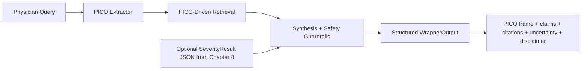
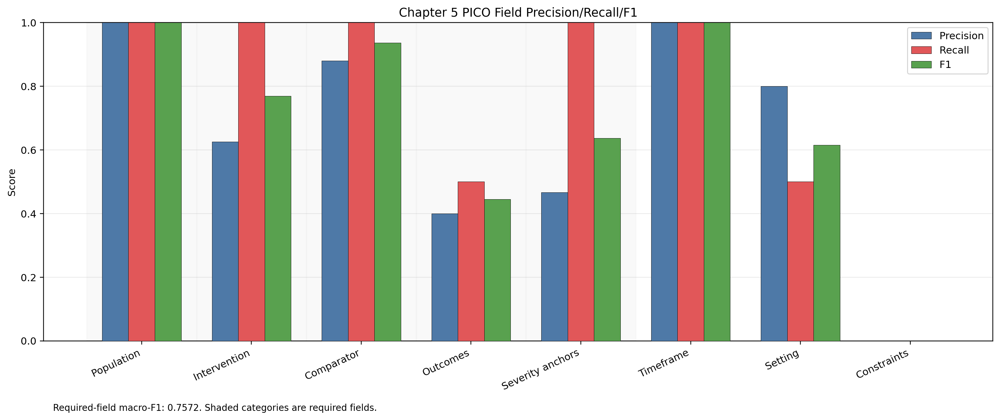
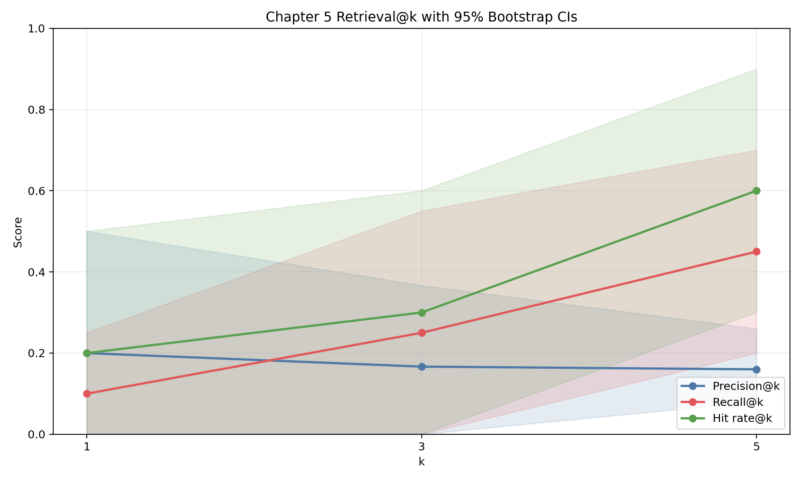
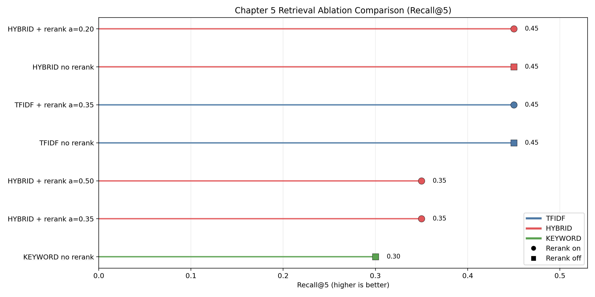
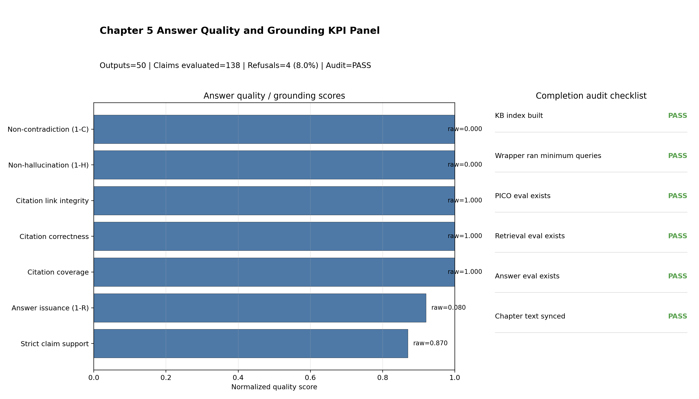

# Chapter 5: PICO-Grounded GenAI Wrapper for Physician Query Support

## 5.1 Chapter Purpose and Contribution

Chapter 5 should be read as the system-integration chapter of the dissertation. Chapters 1 and 2 established the conceptual background of medical VQA and evidence-grounded multimodal reasoning. Chapter 3 then showed that reliability on GI tasks depends on controlled task design rather than unconstrained generation, and Chapter 4 converted that finding into a reproducible UC severity module under a strict internal claim boundary. Chapter 5 builds directly on that foundation by taking the frozen upstream module and embedding it into a physician-query workflow that is auditable, citation-linked, and safety-constrained.

The central methodological shift in this chapter is from *model-centric performance* to *workflow-centric reliability*. The question is no longer only whether a model predicts correctly on a benchmark, but whether a full query-to-answer pipeline exposes evidence, uncertainty, and policy boundaries in a way that can support clinician review.

This direction is aligned with recent PICO-oriented GenAI work in evidence-based medicine, which motivates structured query decomposition and source-grounded synthesis over unconstrained response generation [107].

The chapter contribution is practical and system-level:

1. convert physician-style queries into structured PICO fields;
2. retrieve evidence chunks conditioned on PICO intent;
3. synthesize citation-linked claims under explicit safety rules;
4. preserve compatibility with frozen Chapter 4 severity context via typed schemas;
5. provide reproducible evaluation and completion-audit artifacts.

The chapter therefore acts as the bridge between the controlled scoring engine in Chapter 4 and a safer physician-facing interaction layer, while preserving explicit limits on what the system is allowed to claim.

## 5.2 Boundary Conditions from Chapter 4 Freeze

Chapter 5 is explicitly downstream of the Chapter 4 freeze package:

- `CH4_PART1_SCOPE_FREEZE_20260306.md` [85]
- `CH4_PART2_REPRO_FREEZE_20260306.md` [86]
- `CH4_PART7_DISSERTATION_READINESS_GATE_20260306.md` [87]
- `Prototyping_reformat/DatasetAnalysis/LIMUC/4_reporting/out/pass6_generative_metric_summary.csv` [88]

For cross-chapter consistency, the upstream severity boundary in this chapter aligns to the frozen Pass 5/6/7 reporting policy in Chapter 4 (not exploratory runs). The official internal Chapter 4 reference points used here are:

| Upstream lane (Chapter 4) | Accuracy | Macro-F1 | Balanced accuracy | QWK | Parse rate |
|---|---:|---:|---:|---:|---:|
| Pass 5 supervised | 0.737643 | 0.667330 | 0.670907 | 0.818649 | -- |
| Pass 6 mode1 (primary generative lane) | 0.781930 | 0.727920 | 0.736292 | 0.863656 | 1.000000 |
| Pass 6 mode2 (negative ablation) | 0.548636 | 0.177135 | 0.250000 | 0.000000 | 1.000000 |

In the Chapter 5 pass4 wrapper evaluation run, severity context ingestion is supported by schema (`SeverityResult`) but intentionally disabled for the reported benchmark pass (`has_severity_context=false`) to isolate wrapper behavior [89], [95].

This isolation is intentional rather than accidental. It separates two questions that are easy to conflate: (1) whether the wrapper logic itself is reliable, and (2) whether upstream severity signals improve query answering when injected into that wrapper. By fixing the first question in this chapter, later work can study the second question without ambiguity about which component caused performance changes.

## 5.3 Design Objectives and Non-Objectives

The design policy in Chapter 5 follows the same evidence-discipline used in Chapter 4: explicit contracts, explicit failure behavior, and explicit claim boundaries.

### 5.3.1 Design objectives

1. enforce structured outputs with explicit claims and citations;
2. keep failure behavior visible (refusal/escalation instead of fabricated confidence);
3. preserve deterministic, local reproducibility without external API dependence;
4. keep module boundaries clear so the wrapper can be audited independently of Chapter 4 retraining.

### 5.3.2 Non-objectives in this chapter

1. no patient-specific dosing recommendation generation;
2. no claim of external clinical deployment readiness;
3. no replacement of physician judgement;
4. no claim that current internal KB coverage approximates guideline-complete retrieval.

### 5.3.3 Scope Boundary for Chapter 5 Claims

Primary Chapter 5 claims are restricted to the frozen internal wrapper benchmark protocol: synthetic physician-style query set (`n=50`), PICO gold subset (`n=20`), retrieval gold subset (`n=10`), and pass4 artifact package [93], [95]-[100]. This scope mirrors the Chapter 4 strategy of tightly bounded internal claims before any broad generalization statements.

Accordingly, Chapter 5 should be interpreted as a reproducible engineering and evaluation demonstration of a grounded wrapper architecture. It should not be interpreted as evidence of guideline-complete clinical retrieval, open-domain medical reasoning, or deployment readiness.

## 5.4 System Architecture and Contracts

### 5.4.1 End-to-end processing flow



### 5.4.2 Module-level implementation map

Code root: `Prototyping_reformat/chapter5_pico_wrapper/pico_wrapper/` [89]-[92].

| Module | Responsibility |
|---|---|
| `schemas.py` | Typed contracts (`PicoFrame`, `SeverityResult`, `EvidenceChunk`, `Citation`, `WrapperInput`, `WrapperOutput`) |
| `pico_extract.py` | Rule-based PICO extraction with optional LLM hook and safe fallback |
| `kb_ingest.py` | KB ingestion, chunking, and index metadata generation |
| `retriever.py` | Backend-aware retrieval with PICO-conditioned query composition |
| `synthesis.py` | Deterministic claim synthesis and citation attachment |
| `safety.py` | Refusal/escalation policy and disclaimer enforcement |
| `wrapper.py` | Full pipeline orchestration (`extract -> retrieve -> synthesize`) |
| `ui_support.py` | UI-side formatting and report helpers |

### 5.4.3 Retrieval/index design used in frozen Chapter 5 pass

From `Prototyping_reformat/chapter5_pico_wrapper/results/kb_build_pass4_latest/kb_manifest.json` [94]:

- source files: `3`
- documents: `3`
- chunks: `12`
- chunking: `max_words=180`, `overlap_words=30`, `min_words=30`, `seed=42`
- backend family available: `keyword`, `tfidf`, `semantic_lsa`, `hybrid`
- pass4 reporting backend: `hybrid` with reranker enabled.

### 5.4.4 Safety policy implementation

The wrapper applies explicit safety constraints:

1. dosing-sensitive prompts can trigger refusal behavior;
2. low-evidence retrieval paths trigger conservative uncertainty/limitation text;
3. all outputs include clinician-review disclaimers;
4. policy-excluded claims are tracked separately in answer evaluation.

### 5.4.5 Data contracts and traceability behavior

A core architectural strength of the wrapper is that every pipeline stage emits structured artifacts under typed contracts. `PicoFrame` captures query decomposition, `EvidenceChunk` preserves provenance fields (`doc_id`, `chunk_id`, source path, offsets), and `WrapperOutput` binds claims to citations plus explicit uncertainty and limitations [89]. This is the mechanism through which Chapter 5 enforces inspectability rather than relying on fluent free text.

At run level, persisted `run_config.json`, `wrapper_outputs.jsonl`, and evaluation JSON artifacts form a complete trace from query input to scored output [95]-[100]. This explicit traceability is the main reason Chapter 5 can support completion-audit gating and reproducibility checks in a dissertation context.

## 5.5 Experimental Protocol and Frozen Artifacts

### 5.5.1 Query and gold sets

From `Prototyping_reformat/chapter5_pico_wrapper/data/queries/` (generated through the pipeline workflow [93]):

- `queries.jsonl`: `n=50`
- `pico_gold.jsonl`: `n=20`
- `retrieval_gold.jsonl`: `n=10`

### 5.5.2 Frozen pass used for chapter reporting

This chapter reports the pass4 artifact set to remain consistent with completion audit and figure pipeline:

- KB: `results/kb_build_pass4_latest/`
- wrapper outputs: `results/wrapper_eval_pass4_latest/`
- wrapper output file: `Prototyping_reformat/chapter5_pico_wrapper/results/wrapper_eval_pass4_latest/wrapper_outputs.jsonl` [95]
- evaluations: `results/eval_pass4_latest/`
- completion audit: `results/chapter5_completion_audit_ch5_freeze_20260306/` [100]
- pipeline summary: `results/pipeline_pass4_latest/pipeline_summary.json` [93]

Key wrapper config (`results/wrapper_eval_pass4_latest/run_config.json`) [95]:

| Parameter | Value |
|---|---|
| `run_id` | `chapter5_wrapper_20260305T024427Z_6nx5r2` |
| `mode_requested` | `baseline` |
| `n_queries` | `50` |
| `retrieval_k` | `5` |
| `retrieval_backend` | `hybrid` |
| `rerank_enabled` | `true` |
| `rerank_pool` | `20` |
| `rerank_alpha` | `0.2` |
| `min_top_score_for_answer` | `0.18` |
| `min_mean_score_for_answer` | `0.12` |
| `min_retrieved_for_answer` | `2` |
| `has_severity_context` | `false` |

### 5.5.3 One-command reproducibility path

The canonical local pipeline command [93]:

```bash
python Prototyping_reformat/chapter5_pico_wrapper/scripts/run_full_pipeline.py --tag pass4_latest
```

This executes:

1. query/gold generation,
2. KB build,
3. wrapper run,
4. PICO evaluation,
5. retrieval evaluation (with bootstrap CIs),
6. answer evaluation (including strict support),
7. completion audit generation.

## 5.6 Results

### 5.6.1 PICO extraction quality

Source: `Prototyping_reformat/chapter5_pico_wrapper/results/eval_pass4_latest/pico_eval.json` [96].

| Field | Precision | Recall | F1 |
|---|---:|---:|---:|
| Population | 1.0000 | 1.0000 | 1.0000 |
| Intervention | 0.6250 | 1.0000 | 0.7692 |
| Comparator | 0.8800 | 1.0000 | 0.9362 |
| Outcomes | 0.4000 | 0.5000 | 0.4444 |
| Severity anchors | 0.4667 | 1.0000 | 0.6364 |
| Timeframe | 1.0000 | 1.0000 | 1.0000 |
| Setting | 0.8000 | 0.5000 | 0.6154 |
| Constraints | 0.0000 | 0.0000 | 0.0000 |

Aggregate values:

- required-field macro-F1 (`P/I/C/O + severity_anchors`): `0.7572` (`n=20`)
- all-field macro-F1: `0.6752`

The extractor is recall-heavy for core required fields but has precision weakness in outcomes and severity anchors, indicating broad lexical matching behavior.

From a dissertation perspective, this profile is consistent with a conservative extraction philosophy: prioritize capture of potentially relevant query intent, then rely on retrieval/synthesis guardrails to constrain downstream claims. The practical implication is that extraction precision must be improved in future iterations, but the current behavior is acceptable for a baseline whose primary objective is coverage and traceability.



*Per-field PICO extraction scores; shaded groups in the figure indicate required fields.*

### 5.6.2 Retrieval quality and uncertainty

Source: `Prototyping_reformat/chapter5_pico_wrapper/results/eval_pass4_latest/retrieval_eval.json` [97].

| Metric | @1 | @3 | @5 |
|---|---:|---:|---:|
| Precision@k | 0.2000 | 0.1667 | 0.1600 |
| Recall@k | 0.1000 | 0.2500 | 0.4500 |
| Hit rate@k | 0.2000 | 0.3000 | 0.6000 |

Bootstrap 95% confidence intervals (`2000` iterations, `seed=42`):

| Metric | @1 CI | @3 CI | @5 CI |
|---|---|---|---|
| Precision@k | [0.00, 0.50] | [0.00, 0.3667] | [0.08, 0.26] |
| Recall@k | [0.00, 0.25] | [0.00, 0.55] | [0.20, 0.70] |
| Hit rate@k | [0.00, 0.50] | [0.00, 0.60] | [0.30, 0.90] |

Interpretation: top-5 retrieval gives workable coverage on the current small KB, but wide intervals reflect small retrieval-gold sample size (`n=10`).

The retrieval pattern also aligns with Chapter 3's broader observation that ranking quality in medical VQA pipelines is often brittle at very small `k`, and that clinically usable behavior usually depends on controlled aggregation of several evidence candidates rather than single-hit retrieval. In this chapter, that design choice appears in the final `k=5` operating point.



*Retrieval precision/recall/hit-rate profiles with uncertainty bands.*

### 5.6.3 Retrieval ablation (backend/rerank sensitivity)

Source: `Prototyping_reformat/chapter5_pico_wrapper/results/eval_pass3_ablation/retrieval_ablation_summary.tsv` [99].

| Case | Backend | Rerank | Alpha | Hit@1 | Hit@5 | Recall@5 |
|---|---|---|---:|---:|---:|---:|
| `keyword_no_rerank` | keyword | no | 0.35 | 0.20 | 0.50 | 0.30 |
| `hybrid_rerank_a035` | hybrid | yes | 0.35 | 0.20 | 0.50 | 0.35 |
| `hybrid_rerank_a050` | hybrid | yes | 0.50 | 0.20 | 0.50 | 0.35 |
| `tfidf_no_rerank` | tfidf | no | 0.35 | 0.10 | 0.60 | 0.45 |
| `tfidf_rerank_a035` | tfidf | yes | 0.35 | 0.20 | 0.60 | 0.45 |
| `hybrid_no_rerank` | hybrid | no | 0.35 | 0.20 | 0.60 | 0.45 |
| `hybrid_rerank_a020` | hybrid | yes | 0.20 | 0.20 | 0.60 | 0.45 |

Selected default in pass4: `hybrid + rerank alpha=0.20`, which ties best `Recall@5` while preserving stronger `Hit@1` than non-reranked TF-IDF.

This ablation supports a pragmatic engineering decision: when several configurations tie on top-line recall in a small benchmark, the selected default should favor stability and balanced first-hit behavior over nominal micro-gains that are likely within variance.



*Recall@5 comparison across backend/rerank configurations; multiple settings tie at the top in this small benchmark.*

### 5.6.4 Answer quality and citation grounding

Source: `Prototyping_reformat/chapter5_pico_wrapper/results/eval_pass4_latest/answer_eval.json` [98].

| Metric | Value |
|---|---:|
| Outputs evaluated | 50 |
| Claims extracted | 142 |
| Claims evaluated | 138 |
| Policy claims excluded | 4 |
| Refusal count | 4 |
| Refusal rate | 0.0800 |
| Citation coverage | 1.0000 |
| Citation correctness (heuristic) | 1.0000 |
| Claim support (heuristic) | 1.0000 |
| Claim support (strict) | 0.8696 |
| Contradiction proxy | 0.0000 |
| Hallucination proxy | 0.0000 |
| Citation link integrity | 1.0000 |

Strict support is intentionally harder than the heuristic overlap checks (`min_overlap_ratio=0.25`, `min_overlap_terms=3`), providing a tighter baseline for future manual review.

The answer-evaluation profile demonstrates the intended Chapter 5 tradeoff. The wrapper strongly controls citation linkage and policy behavior, while strict support remains below perfect due to lexical-threshold sensitivity. This is a desirable result for a baseline because it surfaces residual uncertainty explicitly instead of masking it with overly permissive heuristics.



*Composite panel with answer KPIs, refusal rate, and completion audit checklist status.*

### 5.6.5 Post-audit wrapper hardening updates

After auditing the current wrapper codebase, a focused hardening pass was applied while preserving the chapter's frozen pass4 headline metrics:

1. **Index/chunk path robustness:** retrieval now resolves manifest paths relative to both `kb_index/` and manifest directory roots, and can load `chunks_file` directly from manifest metadata [90], [94].
2. **Runtime guardrails in orchestration:** `run_wrapper` now validates retrieval/rerank/evidence-threshold parameters and records resolved backend provenance even when manifest defaults are used [91].
3. **Safer dosing detection coverage:** safety rules were expanded to catch common dosing-unit and schedule phrasing (for example milligram and twice-daily prompts), improving refusal-trigger reliability for high-risk requests [92], [103].
4. **UI caution normalization:** contraindication/adverse-event caution detection now handles both hyphenated and non-hyphenated phrasing in limitations, improving warning consistency [92], [104].

Verification status for this hardening pass: Chapter 5 wrapper unit tests pass (`19/19`) across retrieval, wrapper orchestration, safety, and UI helper modules [101]-[104].

These hardening changes are implementation-level reliability improvements and do not alter the frozen pass4 headline KPI values reported earlier in this chapter.

## 5.7 Error Analysis and Observed Failure Modes

The pass4 evidence indicates recurring and interpretable failure patterns rather than random instability. Three patterns are most important for future improvement planning.

### 5.7.1 Extraction specificity gaps

`outcomes` precision (`0.4000`) and `severity_anchors` precision (`0.4667`) are materially lower than recall, showing over-triggering from broad lexical matching. This means the extractor tends to include plausible-but-not-always-necessary fields. The risk is not immediate hallucination, because synthesis remains citation-constrained, but unnecessary field expansion can still degrade retrieval focus.

### 5.7.2 Retrieval ranking sharpness at low k

Top-rank behavior remains fragile (`Recall@1=0.1000`) even when `Recall@5` improves to `0.4500`. This gap indicates that the current retrieval stack has acceptable coverage at moderate depth but insufficient first-hit sharpness. Operationally, the wrapper mitigates this by using multi-chunk evidence panels rather than a single-chunk decision path.

### 5.7.3 Grounding strictness and policy-side effects

Strict support (`0.8696`) is lower than heuristic support (`1.0000`), confirming dependence on overlap thresholds and lexical representation choices in evaluation. In parallel, refusal behavior reduces answer issuance rate (`92%` non-refusal issuance), which is expected in a safety-constrained design. These two effects together reflect a deliberate Chapter 5 bias toward conservative behavior and auditability over maximal answer volume.

## 5.8 Threats to Validity and Limitations

1. **Small KB footprint:** only `3` source documents and `12` chunks limit retrieval diversity.
2. **Synthetic/small evaluation subsets:** retrieval gold (`n=10`) and PICO gold (`n=20`) are useful for method checks, not broad clinical generalization.
3. **Heuristic grounding metrics:** citation correctness and hallucination proxies are lexical and must be complemented by clinician semantic review.
4. **No external API LLM dependency in baseline:** improves reproducibility but does not yet benchmark richer model-assisted synthesis.
5. **Isolated wrapper benchmark mode:** severity context support exists in schema and architecture, but `has_severity_context=false` in the frozen pass4 benchmark; the integrated end-to-end effect is therefore not claimed in this chapter [89], [95].
6. **No deployment claim:** this chapter demonstrates engineering feasibility and reproducibility, not bedside readiness.

Taken together, these limitations do not weaken the chapter's core contribution. They define the boundary within which its claims are valid: Chapter 5 establishes a reproducible and auditable wrapper baseline, not a finalized clinical product.

## 5.9 Reproducibility and Completion Audit Status

Completion audit source:

- `Prototyping_reformat/chapter5_pico_wrapper/results/chapter5_completion_audit_ch5_freeze_20260306/chapter5_completion_report.json` [100]
- `Prototyping_reformat/chapter5_pico_wrapper/results/chapter5_completion_audit_ch5_freeze_20260306/chapter5_completion_report.md`

Audit status: `PASS` (`6/6` checklist items passed), including artifact existence, minimum query coverage, and chapter-text synchronization checks.

This audit status is methodologically important for dissertation integrity. It means the narrative claims, reported KPI files, and stored pipeline artifacts are synchronized at chapter-freeze time, reducing the risk of text-result drift between experiments and writing.

Core scripts:

- `scripts/build_kb.py`
- `scripts/make_queryset.py`
- `scripts/run_wrapper.py`
- `scripts/run_ui.py`
- `scripts/eval_pico.py`
- `scripts/eval_retrieval.py`
- `scripts/eval_answers.py`
- `scripts/chapter5_completion_audit.py`
- `scripts/run_full_pipeline.py` [93]

## 5.10 Chapter 5 Claim Guardrail

Allowed headline claims:

1. Chapter 5 provides a reproducible, citation-aware wrapper around frozen upstream Chapter 4 severity capability.
2. Required-field PICO extraction and top-5 retrieval show workable baseline behavior on internal benchmark artifacts.
3. Citation-linked synthesis and refusal handling are operational in pass4 and auditable from persisted outputs.

Disallowed headline claims:

1. Do not claim external clinical deployment readiness from the current internal KB and synthetic/small gold subsets.
2. Do not present retrieval or grounding heuristics as a substitute for clinician semantic adjudication.
3. Do not interpret this chapter as replacing Chapter 4 severity model validation.

## 5.11 Chapter Summary and Transition

Chapter 5 delivers a complete PICO-grounded wrapper layer that is structured, safety-constrained, and reproducibility-first. Relative to Chapters 3 and 4, the novelty is not a new backbone architecture; it is the conversion of bounded modeling components into an end-to-end, inspectable physician-query workflow.

The wrapper does not attempt to hide uncertainty. It surfaces citations, documents limitations, and triggers refusal/escalation behavior when prompts enter policy-sensitive territory. This behavior is aligned with the dissertation's broader position that clinical AI utility depends at least as much on transparent failure handling as on average predictive performance.

Relative to a monolithic end-to-end generator, the chapter demonstrates a modular path: frozen visual severity evidence (Chapter 4) plus explicit retrieval-grounded synthesis control. The next dissertation step is to scale this baseline with a larger curated evidence store, stronger retrieval supervision, and clinician-scored semantic grounding studies, while preserving the same claim-discipline and auditability standards used in Chapters 4 and 5.

## 5.12 References (Chapter 5 Sources and Internal Artifacts)

[85] `CH4_PART1_SCOPE_FREEZE_20260306.md`  
[86] `CH4_PART2_REPRO_FREEZE_20260306.md`  
[87] `CH4_PART7_DISSERTATION_READINESS_GATE_20260306.md`  
[88] `Prototyping_reformat/DatasetAnalysis/LIMUC/4_reporting/out/pass6_generative_metric_summary.csv`  
[89] `Prototyping_reformat/chapter5_pico_wrapper/pico_wrapper/schemas.py`  
[90] `Prototyping_reformat/chapter5_pico_wrapper/pico_wrapper/retriever.py`  
[91] `Prototyping_reformat/chapter5_pico_wrapper/pico_wrapper/wrapper.py`  
[92] `Prototyping_reformat/chapter5_pico_wrapper/pico_wrapper/safety.py`  
[93] `Prototyping_reformat/chapter5_pico_wrapper/scripts/run_full_pipeline.py`  
[94] `Prototyping_reformat/chapter5_pico_wrapper/results/kb_build_pass4_latest/kb_manifest.json`  
[95] `Prototyping_reformat/chapter5_pico_wrapper/results/wrapper_eval_pass4_latest/run_config.json`  
[96] `Prototyping_reformat/chapter5_pico_wrapper/results/eval_pass4_latest/pico_eval.json`  
[97] `Prototyping_reformat/chapter5_pico_wrapper/results/eval_pass4_latest/retrieval_eval.json`  
[98] `Prototyping_reformat/chapter5_pico_wrapper/results/eval_pass4_latest/answer_eval.json`  
[99] `Prototyping_reformat/chapter5_pico_wrapper/results/eval_pass3_ablation/retrieval_ablation_summary.tsv`  
[100] `Prototyping_reformat/chapter5_pico_wrapper/results/chapter5_completion_audit_ch5_freeze_20260306/chapter5_completion_report.json`  
[101] `Prototyping_reformat/chapter5_pico_wrapper/tests/test_retriever.py`  
[102] `Prototyping_reformat/chapter5_pico_wrapper/tests/test_wrapper_pipeline.py`  
[103] `Prototyping_reformat/chapter5_pico_wrapper/tests/test_safety.py`  
[104] `Prototyping_reformat/chapter5_pico_wrapper/tests/test_ui_support.py`  
[107] Mohammed S, Fiaidhi J. *Generative AI for Evidence-Based Medicine: A PICO GenAI for Synthesizing Clinical Case Reports.* ICC 2024. https://ieeexplore.ieee.org/abstract/document/10622271
