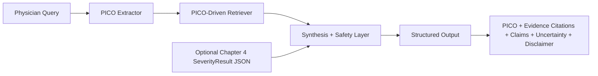

# Chapter 5: PICO-Grounded GenAI Wrapper for Physician Query Support

## 5.1 Motivation and Objective

Chapter 4 delivered the finalized UC severity rating component on LIMUC, including a frozen generative run with reproducible artifacts. Chapter 5 extends this into a physician-facing decision-support wrapper that answers clinical queries in a structured, citation-grounded format.

The goal is not to replace clinician judgement or to issue treatment dosing. The goal is to provide a safer, traceable GenAI interface that:

1. parses physician queries into PICO structure,
2. retrieves local evidence relevant to that structure,
3. incorporates optional Chapter 4 severity context,
4. returns claims tied to explicit citations and uncertainty statements.

## 5.2 Link to Chapter 4 (Frozen Upstream Severity Component)

Chapter 4 is treated as frozen evidence. The upstream severity component referenced in this chapter is:

- Chapter 4 run id: `vlm_lora_finetune_mayo_balanced_full_20260303_20260303T080754Z`
- run folder: `Prototyping_reformat/DatasetAnalysis/LIMUC/3_vlm_severity/results/vlm_lora_finetune_mayo_balanced_full_20260303`
- test metrics (`metrics_test.json`): accuracy `0.7200`, macro-F1 `0.6816`, balanced accuracy `0.6985`, QWK `0.8231`, parse rate `1.0000`

In Chapter 5, this component is integrated by `SeverityResult` input schema and optional JSON ingestion. No Chapter 4 retraining is performed here.

## 5.3 System Architecture

### 5.3.1 Processing Flow

### 5.3.2 Implemented Modules

Code root: `Prototyping_reformat/chapter5_pico_wrapper/pico_wrapper/`

- `schemas.py`: strict contracts for `PicoFrame`, `SeverityResult`, `EvidenceChunk`, `Citation`, `WrapperInput`, `WrapperOutput`
- `pico_extract.py`: baseline rule-based PICO + severity anchor extraction, LLM hook with safe fallback
- `kb_ingest.py`: KB chunking + indexing (TF-IDF backend with keyword fallback)
- `retriever.py`: PICO-aware retrieval composition and ranking
- `synthesis.py`: deterministic claim synthesis with citation linkage
- `safety.py`: refusal/escalation logic and standard disclaimer
- `wrapper.py`: orchestration (extract -> retrieve -> synthesize)

## 5.4 Safety and Clinical Constraints

Safety policy is explicitly implemented:

1. no patient-specific dosing instructions,
2. if evidence is weak or missing, output "Insufficient evidence in retrieved sources.",
3. always include uncertainty and clinician-review disclaimer.

This wrapper is positioned as educational and decision-support tooling, not autonomous treatment recommendation.

## 5.5 Experimental Setup and Artifacts

### 5.5.1 Query and Gold Sets

- queries: `Prototyping_reformat/chapter5_pico_wrapper/data/queries/queries.jsonl` (`n=50`)
- PICO gold subset: `Prototyping_reformat/chapter5_pico_wrapper/data/queries/pico_gold.jsonl` (`n=20`)
- retrieval gold subset: `Prototyping_reformat/chapter5_pico_wrapper/data/queries/retrieval_gold.jsonl` (`n=10`)

### 5.5.2 KB and Wrapper Runs

- KB manifest: `Prototyping_reformat/chapter5_pico_wrapper/results/kb_build_latest/kb_manifest.json`
- wrapper outputs: `Prototyping_reformat/chapter5_pico_wrapper/results/wrapper_eval_latest/wrapper_outputs.jsonl`
- wrapper config: `Prototyping_reformat/chapter5_pico_wrapper/results/wrapper_eval_latest/run_config.json`

### 5.5.3 Evaluation Outputs

- PICO eval: `Prototyping_reformat/chapter5_pico_wrapper/results/eval_latest/pico_eval.json`
- retrieval eval: `Prototyping_reformat/chapter5_pico_wrapper/results/eval_latest/retrieval_eval.json`
- answer eval: `Prototyping_reformat/chapter5_pico_wrapper/results/eval_latest/answer_eval.json`
- manual rubric template: `Prototyping_reformat/chapter5_pico_wrapper/results/eval_latest/answer_manual_rubric_template.json`

## 5.6 Results

### 5.6.1 PICO Extraction

Source: `Prototyping_reformat/chapter5_pico_wrapper/results/eval_latest/pico_eval.json`

| Field | Precision | Recall | F1 |
|---|---:|---:|---:|
| Population | 1.0000 | 1.0000 | 1.0000 |
| Intervention | 0.6250 | 1.0000 | 0.7692 |
| Comparator | 0.8800 | 1.0000 | 0.9362 |
| Outcomes | 0.4000 | 0.5000 | 0.4444 |
| Severity anchors | 0.4667 | 1.0000 | 0.6364 |

Required-field macro-F1 (`P/I/C/O + severity anchors`): `0.7572` on `n=20`.

### 5.6.2 Retrieval Quality

Source: `Prototyping_reformat/chapter5_pico_wrapper/results/eval_latest/retrieval_eval.json`

| Metric | @1 | @3 | @5 |
|---|---:|---:|---:|
| Precision@k | 0.1000 | 0.1667 | 0.1600 |
| Recall@k | 0.0500 | 0.2500 | 0.4500 |
| Hit rate@k | 0.1000 | 0.3000 | 0.6000 |

This indicates moderate top-5 retrieval coverage in the current small internal KB setting, with clear headroom for expanded clinical source ingestion.

### 5.6.3 Answer Quality and Citation Grounding

Source: `Prototyping_reformat/chapter5_pico_wrapper/results/eval_latest/answer_eval.json`

| Metric | Value |
|---|---:|
| Outputs evaluated | 50 |
| Claims evaluated (policy exclusions applied) | 138 |
| Refusal count | 4 |
| Citation coverage | 1.0000 |
| Citation correctness (heuristic) | 1.0000 |
| Hallucination proxy | 0.0000 |
| Citation link integrity | 1.0000 |

The wrapper successfully enforces citation-linked claims in this baseline run and handles dosing-sensitive prompts via refusal logic.

## 5.7 Discussion, Failure Modes, and Limitations

Key limitations in the current Chapter 5 baseline:

1. PICO extraction is rule-based; outcome and severity phrase normalization still shows precision trade-offs.
2. Retrieval evaluation is run on a small synthetic labeled subset and internal sample docs; external validity remains limited.
3. Citation-correctness uses lexical heuristics and should be complemented by clinician/manual semantic review.
4. LLM mode is a plug-in interface only; no external API dependency is used in this baseline.

Failure modes observed:

1. retrieval misses for narrowly phrased comparator/outcome variants,
2. broad severity-anchor matches increase recall but can reduce precision,
3. refusal claims require separate handling in hallucination scoring (implemented in evaluation script).

## 5.8 Reproducibility Status

The Chapter 5 pipeline is reproducible with local scripts only:

- `scripts/build_kb.py`
- `scripts/make_queryset.py`
- `scripts/run_wrapper.py`
- `scripts/run_ui.py` (local browser interface for interactive physician-query testing)
- `scripts/eval_pico.py`
- `scripts/eval_retrieval.py`
- `scripts/eval_answers.py`
- `scripts/chapter5_completion_audit.py`

All intermediate artifacts are persisted under `Prototyping_reformat/chapter5_pico_wrapper/results/`.

## 5.9 Chapter Summary and Transition to Chapter 7

Chapter 5 converts the Chapter 4 severity model into a structured GenAI decision-support wrapper that is citation-aware, safety-constrained, and reproducibility-first. The core contribution is the integration of PICO extraction, retrieval grounding, and controlled synthesis around a frozen severity module rather than a single end-to-end opaque generator.

The next stage (Chapter 7) can build on this foundation by adding richer external clinical KB coverage, stronger retrieval supervision, and clinician-scored rubric studies for real-world utility validation.
